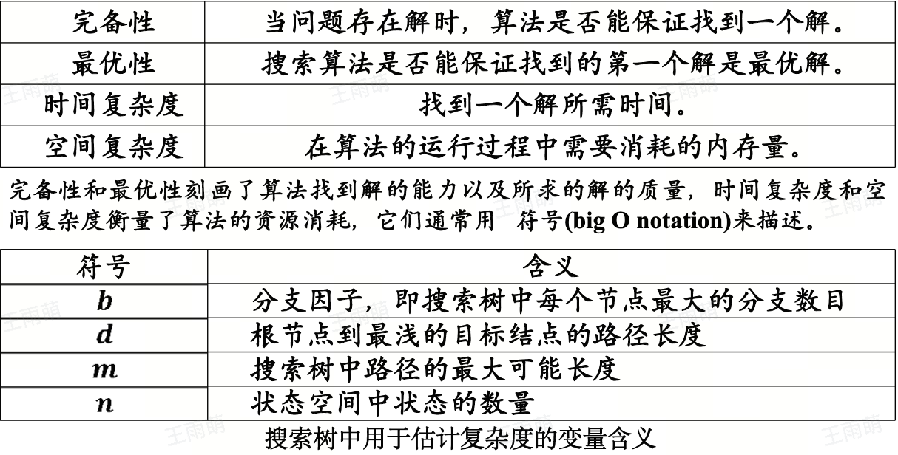
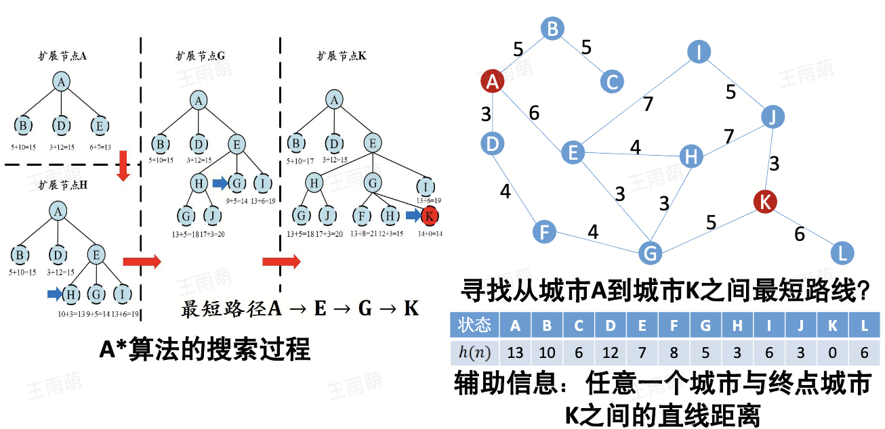
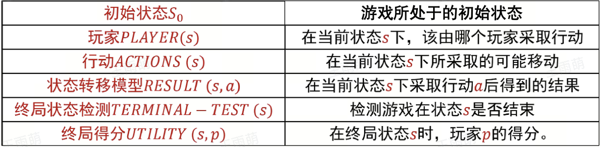

# 第三章 搜索

## 搜索算法基础

> 搜索算法形式化描述：
>
> + **状态**：对智能体和环境当前情形的描述，例如，在最短路径问题中，城市可作为状态。将原问题对应的状态称为初始状态
> + **动作**：从当前时刻所处状态转移到下一时刻所处状态所进行操作。
> + **状态转移**：对智能体选择了一个动作之后，其所处状态的相应变化
> + **路径/代价**：一个状态序列，该状态序列被一系列操作所连接
> + **目标测试**：（每走一步）评估当前状态是否为目标状态

搜索树：用一棵树的数据结构来记录算法探索过的路径

+ 一个标号可能有多个节点与之对应，同一个标号一定表示相同的状态，其含义为智能体当前所在的城市
+ 搜索算法是一个构建搜索树的过程，会时刻记录所有从初始结点出发已经探索过的路径。

## 启发式搜索

在搜索的过程中利用与所求解问题相关的辅助信息，其代表算法为贪婪最佳优先搜索($Greedybest-firstsearch$)和A*搜索

### 贪婪最佳优先搜索

+ key idea：评价函数$f(n)$ = 启发函数$h(n)$

### A*算法

+ 评价函数：$f(n) = g(n) + h(n)$
  + $g(n)$ 表示从起始节点到节点 $n$ 
  + $h(n)$

## 对抗搜索

> 本课程讨论的是全局可观察的、确定的零和博弈的背景下的对抗搜索

+ 最小最大搜索：计算最优策略的方法
+ Alpha-Beta剪枝搜索：对最小最大搜索算法的优化，剪枝无需搜索的节点
+ 通过采样而非穷举方法来实现搜索

**对抗搜索问题模型**：

### MiniMax算法

注意主要讨论在确定的、全局可观察的、竞争对手轮流行动、**零和游戏(zero-sum)下的对抗搜索**

+ 一定是从左往右搜索
+ 如果有影响，那么我们继续搜索，如果没有影响，则对这个节点下停止搜索，剪枝，然后开始下一个兄弟节点并从最左边的子节点开始搜索。

然后我们现在就是维护两个变量$\alpha$和$\beta$

### 蒙特卡洛树搜索

单一状态的蒙特卡洛规划：多臂赌博机

+ 多笔赌博机问题

我们要明确蒙特卡洛树搜索算法的基本思想：
