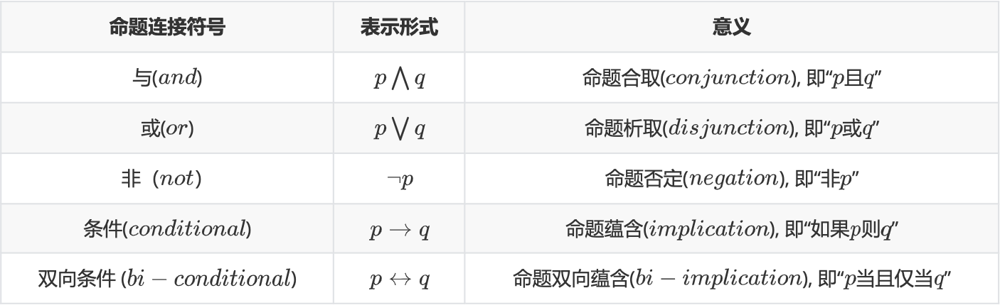
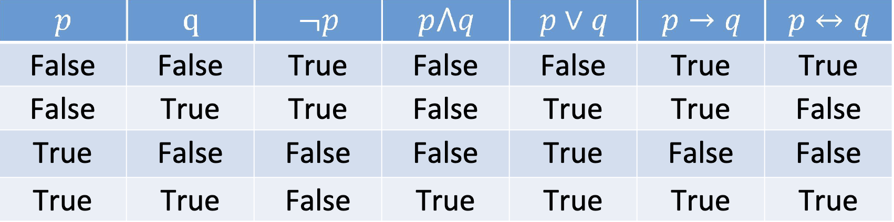
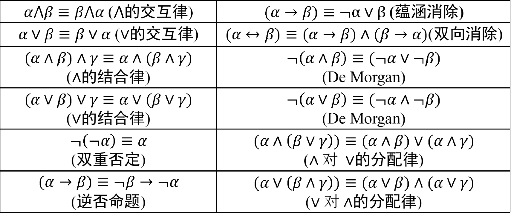

# 第二章 逻辑与推理

> 本章知识点提要：
>
> + 命题逻辑
> + 谓词逻辑
> + 知识图谱推理
> + 因果推理

## 命题逻辑

### 命题

> 注意，判断一个命题是真是假的前提是，**这个句子是不是命题**

**命题**：**确定真值**的**陈述句**，无法判断正误的句子都不能作为命题
**原子命题**：一个或真或假的描述性陈述
**复合命题**：若干原子命题可通过逻辑运算符来构成

+ 任何一个命题，或为真，或为假

### 命题联结符

命题逻辑等价命题转换：(有点类似于数字逻辑的规律)

## 谓词逻辑

谓词逻辑中有三个重要的概念：个体、谓词、量词

