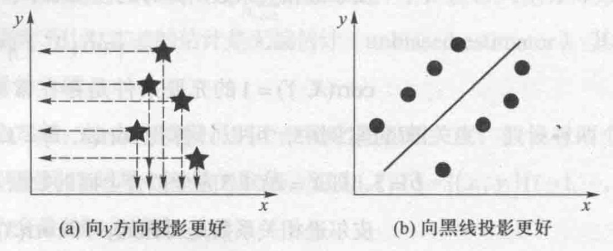
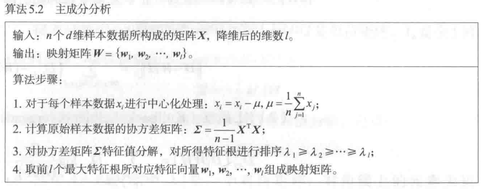
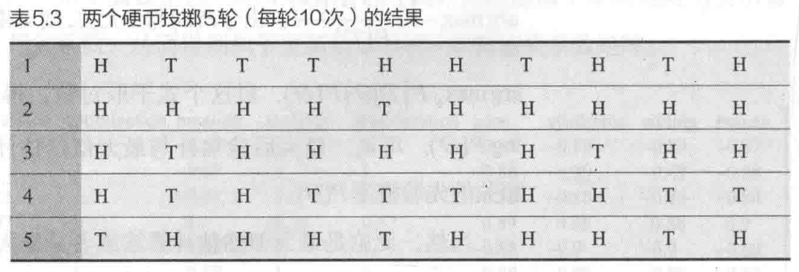
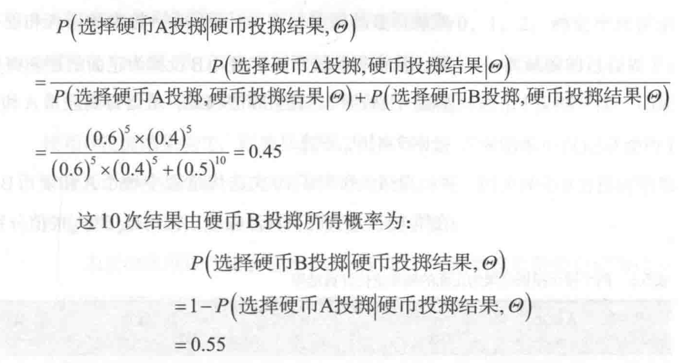
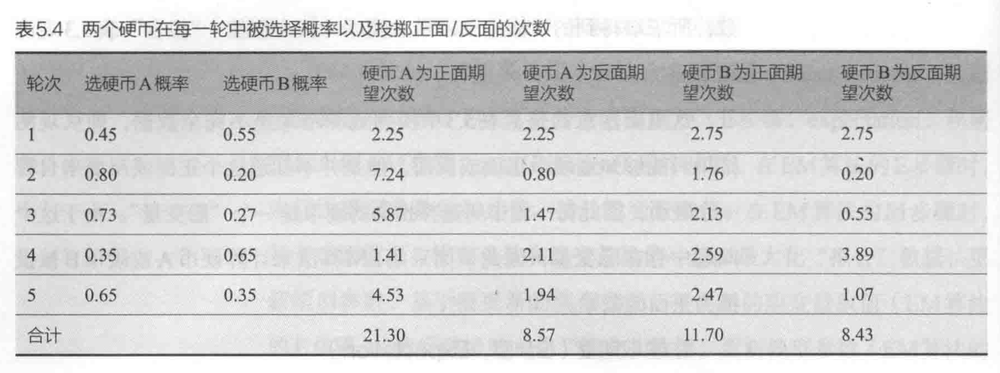
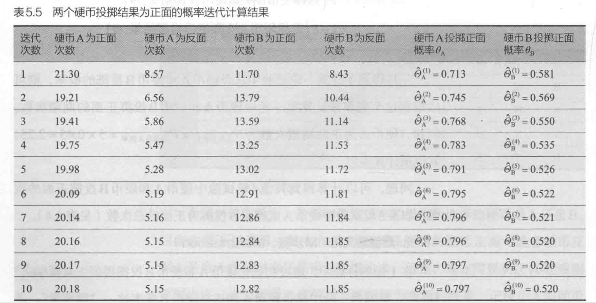

# 第五章 无监督学习

无监督学习的框架：

+ 数据特征选择
+ 相似函数设定

## K-means 算法

**几个先验（经验）值**：目标聚类数量$K$, K个质心初始值$c = \{c_1, c_2,..., c_K\}$

注意，**K-means度量的是欧氏距离，不是其他距离**。欧式距离**假设数据的每个特征维度重要性一致**，但是我们知道对于现实的多维数据，这样的假设并不成立。

step1：初始化K个质心

step2：迭代

> 迭代终止条件：
> 📈 达到迭代次数上限
> 📉 前后两次迭代中，聚类质心保持不变

+ 计算每个样本到K个质心的距离
+ 确定每个样本所属的质心（选择离他最近的）
+ 根据每个类中所属的所有样本来计算更新质心

## PCA 算法

PCA要求 “降维后结果要保持原有数据的原有结构”

### 方差、协方差、相关系数

皮尔逊相关系数具有的性质：（反应X、Y两个变量之间的线性相关性）**绝对值越接近1那么线性相关性越强。**

### 主成分分析

这件事情很好理解，我们观察下面两个图像：

就是说我们可以把高维数据保持原有信息量的情况下压缩到低维空间。

我们原本的多维数据为$n \times d$的矩阵 $X$，然后现在我们是要求取一个$d \times l$的映射矩阵 $W$。给定一个样本 $x_i$，可以将 $x_i$ 从 $d$ 维空间映射到 $l$ 维空间：

> 这里需要提示一个很重要的事情，我们这里**假设了数据的每一个维度的特征均值均为0（已经标准化）**，这一点你会在PCA算法中看到，若果没有这个性质，我们需要进行标准化操作。

$$x_i \rightarrow W^T x_i$$

所有降维后的数据表示为：

$$Y = XW, Y \in R^{n \times l}$$

对于降维后的数据，我们期望数据尽可能保持原有的信息，在数据分布上就表现为**方差大（参照上面两个图像的直观感觉）**

$$var(Y) = \frac{1}{n-1}tr(Y^T Y) = tr(W^T \frac{1}{n-1}X^T X W)$$

我们令 $\Sigma = \frac{1}{n-1}X^T X$

于是我们目标如下：

$$\underset{W}{max} \;tr(W^T\Sigma W)$$

因为$W$是一个方向矩阵，所以我们可以有一个大小限制：

$$w_i^Tw_i = 1, \forall i \in \{1,2,...,l\}$$

然后我们得到一个拉格朗日函数并且求导（省略），于是我们有下面的结果：

$$\Sigma W = \lambda W$$

---

## 期望最大化算法

本小节聚焦于（Expectation Maximization，EM算法），EM算法是一种迭代算法，用于求解含有隐变量的概率模型的极大似然估计。

一共分为两个步骤：

+ E-step：**求期望**，先假设模型参数的初始值，估计隐变量的取值
+ M-step：**求极大**，基于观测数据、模型参数和隐变量取值一起来最大化“拟合”数据，更新模型参数

### 案例 - 两个硬币投掷案例

假设有A和B两个硬币，进行5轮投掷硬币实验：在**每一轮**实验中，**随机选一个硬币，然后使用所选择的硬币投掷10次**，将投掷结果作为本轮实验的观测结果，如下图（H代表硬币正面向上，T代表硬币反面向上）：

根据题设分析：

+ 要训练出来的模型参数：硬币A或硬币B被投掷为正面的概率$\Theta = \{\Theta_A,\Theta_B \}$
+ 隐变量（隐含在题设中的变量）：每一轮选择投掷的隐币

---

紧接着，我们进行E步骤。

首先我们初始化模型想训练出来的参数$\hat{\Theta}^{(0)}  = \{\hat{\Theta}^{(0)}_A,\hat{\Theta}^{(0)}_B \} = \{0.6,0.4\}$
，依据这个概率值，**我们结合已经有的5轮次的实验结果计算每一轮隐变量的值。**

计算隐变量的方法，源自贝叶斯方法：（先验-后验思想）

$$P(w|D) = \frac{P(D|w)P(w)}{P(D)}$$

然后计算硬币A为正面期望次数

$$N_{正面总次数} \times P_{选择硬币A的概率} = 5 \times 0.45 = 2.25$$

类似地，我们对每一轮进行上面的计算，有下表：

---

接着，我们进行M步骤。并且开始最终的迭代算法。

我们根据表格5.4，我们计算出新的模型参数（朴素概率方法）：

$$\hat{\Theta}^{(1)}_A = \frac{21.30}{21.30+8.57} = 0.713,\hat{\Theta}^{(1)}_B = \frac{11.70}{11.70+8.43} = 0.581$$

然后我们根据新的参数而不是从初始化的参数，带回E步骤进行新的一轮的迭代计算，最终有结果如下（参数收敛）：

