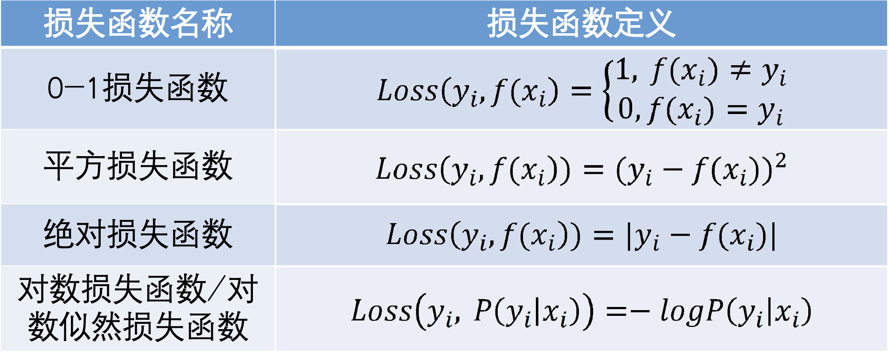
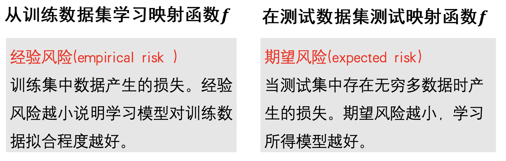
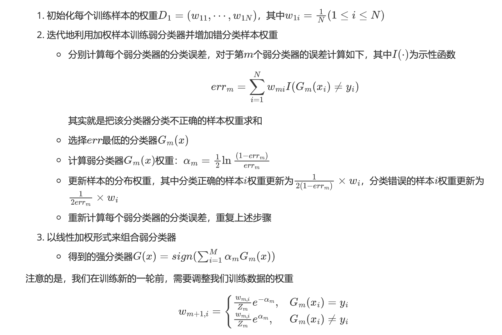

# 监督学习

机器学习是联结主义象征的一大学习方法：就是从数据中学习知识

+ 监督学习：数据有标签，一般为回归或者分类任务
+ 无监督学习：数据无标签，一般为聚类或者若干降维任务
+ 强化学习：序列数据决策学习，一般为与从环境交互中学习

标注数据：学什么
学习模型：如何学习
损失函数：对学习成果度量

## 机器学习基本概念

### 损失函数

不同任务选取的损失函数不同。

### 经验风险、期望风险

我们的映射函数训练的目标：**期望风险最小化**

### 判别模型和生成模型

？我没明白生成模型的概念。

## 回归分析

请记住一元线性回归的优化结果的解析解(**很大概率考察**)：

$$a = \frac{\sum_{i=1}^n (x_i - \bar{x})(y_i - \bar{y})}{\sum_{i=1}^n (x_i - \bar{x})^2} = \frac{\sum_{i=1}^n x_i y_i - n\bar{x}\bar{y}}{\sum_{i=1}^n x_i^2 - n\bar{x}^2}$$

$$b = \bar{y} - a\bar{x}$$

？ 在多元线性回归中，为什么要求对每一个数据$x_i$扩展一个维度

### LDA

> 自己和自己的协方差就是方差，自己和别人的协方差就是标准协方差。

其实我们从LDA的目标可以直接构造出来我们想要优化的对象函数。

我们首先描述类内方差：(以二分类问题为例)

$$S_w = \Sigma_1 + \Sigma_2$$

注意，$\Sigma_i = \sum_{x \in X_i} (\mathbf{x} - \mathbf{m_i})(\mathbf{x} - \mathbf{m_i})^T$，其中$\mathbf{m_i}$是第$i$类的均值向量。

我们其次描述的是类间方差：

$$S_b = (\mathbf{m_1} - \mathbf{m_2})(\mathbf{m_1} - \mathbf{m_2})^T$$

然后我们描述一个用来优化的目标函数，因为我们的目标是使得类内方差变小，类间方差变大，所以我们可以想到下面这个形式的函数，并且我们的目标就可以很单一 - 使得$J(w)$在$w$意义下最大：

$$J(w) = \frac{w^TS_bw}{w^TS_ww}$$

因为我们最后的解只与$w$的方向有关，与$w$的大小无关，于是我们可以令$w^TS_ww = 1$，然后我们把这个转换为拉格朗日极值问题：

$$L(w) = w^TS_bw - \lambda(w^TS_ww - 1)$$

然后因为对于是二分类的问题，我们根据求导的结果：
(因为和$w$的大小无关，所以$(m_2-m_1)^Tw$可以被认为是常数，然后约去)

$$w = S_w^{-1}(m_2 - m_1)$$

### Ada Boost

强可学习和弱可学习是等价的，也就是说，如果已经发现了“弱学习算法”，可将其提升（boosting）为“强学习算法”

AdaBoosting将一系列弱分类器组合起来，构成一个强分类器。

1. 越难分的样本权重越大
2. 越好的弱分类器权重越大

AdaBoosting算法的整体思路：

初始化训练样本权重 -> **计算每个训练器的err并且挑选最小err的训练器** -> 使用最小err的训练器计算该训练器的权重$\alpha_m$并使用它更新所有样本的权重 -> 继续迭代

