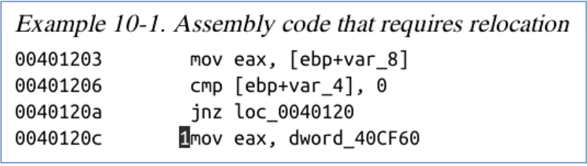

# 课堂测试题目整理

> 课堂测试题目将会按照章节整理

|序号|易错点|备注|
|:---:|:---:|:---:|
|1|十六进制数表示规范|注意在汇编考试中，十六进制数如果结果以字母开头需要前缀加0，后缀加h（0FFFFFh）|

## 第一章 汇编语言基本概念

Python是解释执行的

**题目一**：汇编、C++、Java、Python语言出现时间顺序

$$Assembly < C++ < Python < Java$$

## 第二章 IA32处理器结构

**题目一**：CPU内部包括哪些基本部件？

$$ALU,CU,Register,Clock$$

**题目二**：CPU、总线、内存这三个设备哪个时钟频率最高？

$$Solution: CPU$$

**题目三**：数据在CPU中存储的位置

$$Register 寄存器$$

**题目四**：一条CPU指令的执行周期包括哪些操作？ 其中占用时间最多的操作有哪些

    + 取指令
    + 解码：控制单元CU确定执行什么操作
    + 取操作数：从内存中读操作数
    + 执行：ALU中执行
    + 存储输出操作数：向内存中写入
  
  在这些操作中，通常占用时间最多的操作是**取操作数和执行**。

**题目五**：哪种操作模式（保护模式/实地址模式/虚拟8086模式），程序可以拥有4GB的地址模式？

$$Solution:保护模式$$

**题目六**：高级语言的if、for、while等的**条件判断**过程在CPU中是如何实现

+ 比较操作：CPU首先执行相关的比较指令，比如比较两个寄存器的值。**比较结果会设置状态寄存器中的标志位**（如零标志位、符号标志位等）。
+ 条件跳转：**根据标志位的状态**，CPU会执行条件跳转指令（如JZ、JNZ等），跳转到对应的代码块。

**题目七**：两个*无符号整数*A、B，A减B之后的CPU的状态寄存器的CF、ZF标志位的结果如下，如何使用CF、ZF来表示A与B的大小关系：

+ ``ZF == 0`` 说明 A = B
+ ``CF == 1`` 说明 A > B
+ ``CF == 0 && ZF == 0`` 说明 A < B

**题目八**：基于段的内存管理方式有哪些缺点？

<p><center>答：会产生碎片</center></p>

**题目九**：通过虚拟地址读取一个内存数据，至少要访问多少次内存？

<p><center>答：3次，页目录、页表、页共计3次</center></p>

## 第三章 汇编语言基础

**题目一**：判断：伪指令是在程序运行时执行的

<p><center>错误，在编序编译之前就处理好了</center></p>

**题目二**：声明一个包含单词“TEST“重复50次的字符串变量

<p><center>BYTE 50 DUP("TEST")</center></p>

**题目三**（考点）：使用$计算数组中有几个dw数据?

```Assembly
dw_array DWORD 0,1,2,3,4
array_size  = ?
```

$Solution:$

```Assembly
array_size = ($ - dw_array)/4 ;4是指的是4个BYTE的意思
```

## 第四章 数据传送、寻址和算数运算

**题目一**：``ECX = 0``时LOOP循环执行次数是多少？

```asm

```

$$Solution:\;\; The\;\; answer\;\; is\;\; 2^{32}$$

**题目二**：数组求和程序书写

给出一个数组``array DWORD 100h,200h,300h,400h``

$$Solution:\;\; The\;\; anwer \;\;is\;\;below$$

```asm
.data
  array DWORD 100h,200h,300h,400h
.code
  MOV ECX,LENGTHOF array
  MOV EDI,OFFSET array
  MOV EAX,0
L1:
  ADD EAX,[EDI]
  ADD EDL,TYPE array
  LOOP L1
```

**题目三**：字符串赋值程序书写

给出一个字符串``str BYTE "Hello Word",0DH,0AH,0``

$$Solution:\;\; The\;\; anwer \;\;is\;\;below$$

```asm
.data
  src BYTE "Hello Word",0DH,0AH,0
  dst BYTE SIZEOF srcDUP(0),0
.code
  MOV ECX,SIZEOF src
  MOV ESI,0
L1:
  MOV AL,BYTE PTR src[ESI]
  MOV BYTE PTR dst[ESI],AL
  INC ESI
  LOOP L1
```

**题目四**：将数组``num BYTE 0,1,2,3,4,5,6,7,8,9``转换为ASCII码

```asm
.data 
  BYTE 1,2,3,4,5,6,7,8,9,10
.code
  MOV ECX,10
  MOV ESI,0
L1:
  MOV AL,BYTE PTR num[ESI]
  ADD AL,30h
  MOV BYTE PTR num[ESI],AL
  INC ESI
  LOOP L1
```

**题目五**：如何访问下面数组``var1 DWORD 100h,200h,300h``中的内存值``200h``?

$$Solution:\;\; The\;\; anwer \;\;is\;\;below$$

```asm
.code
  mov eax,[var1 + 4] ;注意这里是4而不是1！注意数据类型宽度
```


**题目六**：``inc [eax]``为什么会报错？

在汇编程序运行中，``INC``指令只有一个操作数，而上面的代码并没有告诉INC指令操作的宽度，不知道加``DOWRD``还是其他的数据类型宽度。

我们修改的思路如下：

+ MOV间接增加地址：

```asm
MOV EBX, [EAX]   ; 将 EAX 指向的内存值加载到 EBX
INC EBX          ; 对 EBX 的值加1
MOV [EAX], EBX   ; 将加1后的值存回 EAX 指向的内存地址
```

+ 增加数据类型宽度

```asm
INC DWORD PTR [eax]
```

**题目七**：内存地址指针的尺寸大小

$Solution:$只要不是段寄存器，我们认为无论指针指向什么类型的数据，指针的尺寸都是``4 BYTE``

**题目八**：汇编语言中用的最多的指令是？

<p><center>A.数据传送指令 B.算术运算指令 C.跳转指令D.函数调用指令</center></p>

<p><center>答案 A</center></p>

**题目九**：为什么mov指令的操作码（88,89,8A,8B...）有很多个？

$Solution$：mov 指令的操作码有多个（如 88, 89, 8A, 8B 等），是因为它需要涵盖不同的操作类型和目标：包括从寄存器到内存、从内存到寄存器、寄存器之间，以及立即数到寄存器或内存等。每种操作类型和数据宽度（如 8 位、16 位、32 位）都需要一个对应的操作码，这样才能区分指令的具体含义。

**题目十**：分别写出下面两段程序运行后EAX、EBX的十六进制的值

```Assembly
.data
  var1 BYTE 10h
.code
  movzx eax,var1
  movsz ebx,var1
```
<p><center>eax:00000010h , ebx:00000010h</center></p>

```Assembly
.data
  var1 BYTE 0A0h
.code
  movzx eax,var1
  movsz ebx,var1
```

<p><center>eax:000000A0h, ebx:0FFFFFFA0h</center><p>

!!! Tip "提醒"
    写出十六进制的结果的时候如果是字母开头一定要记得加上0做为开头！

**题目十一**：根据下面的程序片段，写出var1的十六进制的值是多少

```asm
.data
  var1 DWORD 1000h
.code
  neg var1
```

答案：0FFFFF000h，首先你要明白指令是对那一块内存进行操作的，汇编语言中没有变量这个概念。var1在内存中以DWORD32bits存储：``0000 0000 0000 0000 0001 0000 0000 0000``，然后对这一段内存取补码然后转换为16进制就是答案。


**题目十二**：写出寄存器eax的十六进制值

```Assembly
.data
  var1 DWORD 12345678h
.code
  movzx eax,BYTE PTR var1
```

<p><center>eax = 00000078h,注意小端序存储问题</center></p>

```Assembly
.data
  var1 DWORD 1234h
  var2 DWORD 5678h
.code
  mov eax,DOWRD PTR var1;
```

<p><center>eax = 56781234h</center><p>

**题目十三**：写出eax寄存器十六进制的值

```Assembly
.data
  w_var LABEL DWORD
  var1 DWROD 12345678h
.code
  movzx eax,w_var
```

<p><center>eax = 00005678h，注意小端序存储并且eax转换为16进制后是8位</center><p>

**题目十三**：LOOP循环执行次数是多少

```Assembly
MOV EAX,10h
MOV ECX,0
L1:
  INC EAX
  LOOP L1
```

<p><center>LOOP循环执行次数位100000000h次数</center><p>

**题目十四**：计算数组之和

```Assembly
.data
  array DWROD 100h,200h,300h,400h
```

数组求和一般的代码模板如下，注意数据类型等经典错误

```Assembly
.data
  array DWROD 100h,200h,300h,400h
.code
  MOV ECX,LENGTHOF array
  MOV EDI,OFFSET array
  mov EAX,0
L1:
  ADD EAX,[EDI] ;从段偏移地址中取出具体值来
  ADD EDI,TYPE array
```

我们使用间接操作数``ESI``的方法：

```Assembly
.data
  array DWROD 100h,200h,300h,400h
.code
  MOV ESI,OFFSET array
  mov EAX,0
L1:
  ADD EAX,[ESI] ;从段偏移地址中取出具体值来
  ADD ESI,TYPE array
```

我们还可以使用变址操作数的方法：

```Assembly
.data
  array DWROD 100h,200h,300h,400h
.code
  mov EAX,0
L1:
  ADD EAX,[array+ESI] ;[constant+ESI]
  ADD ESI,TYPE array
```

**题目十五**：将字符串src复制到dst

```Assembly
.data
  src BYTE"HEllo World",0AH,0DH,0
  dst BYTE  SIZEOF src DUP(0),0
```

下面我们直接给出代码解释：

```Assembly
.data
  src BYTE "Hello World",0Dh,0Ah,0
  dst BYTE  SIZEOF src DUP(0),0
.code
  MOV ECX,SIZEOF src
  MOV ESI,0
L1:
  MOV AL,BYTE PTR src[ESI]
  MOV BYTE PTR dst[ESI],AL
  INC ESI
  LOOP L1
```

**题目十六**：编写一段汇编代码，将num数组中的数字转换成对应的ASCII字符，输出到命令行窗口，具体数组代码参考data段

```Assembly
.data
  num BYTE 1,2,3,4,5,6,7,8,9,0
.code
  ;将数字转换成对应的ASCII字符，输出到命令行窗口
```

下面是完整的代码，一般访问数组+下表索引数组的元素我们一般使用`ESI`寄存器来间接寻址

```Assembly
.data
  num BYTE 1,2,3,4,5,6,7,8,9,0
.code
  MOV ECX,10 ;循环次数
  MOV ESI,0 ;索引 - 数组
L1:
  MOV AL,BYTE PTR num[ESI]
  ADD AL,30h ;0 - '30h',1 - '31h'，以此类推
  MOV BYTE PTR num[ESI],AL
  INC ESI
  LOOP L1
```

**题目十七**：如何访问没有显示标号的内存值2000h？

```Assembly
.data
  var1 DWORD 1000h,2000h,3000h
.code
  mov eax,[填空]
```

!!! Error "内存访问易错题"
    容易写成数组下标，``[var1+1]``这是错误的理解

**正确的答案**是``mov eax,[var1+4]``,``4``是指代DWORD是4字节宽度，然后他会移动四字节开始按照eax的4字节宽度读取内存，最后读取进去2000h

**题目十八**：``inc [eax]``报错的原因可能是？

INC 指令只能用于操作内存中的完整数据（如 DWORD PTR [eax] 表示一个 4 字节值），但编译器可能需要明确指明操作数的大小。如果不指定，汇编器可能无法确定操作数大小，导致报错。

**题目十九**：变量ptr1的尺寸？

```Assembly
PBYTE TYPEDEF PTR BYTE 
.data
  var1 BYTE 10h
  ptr1 PBYTE var1
```

这里仍然很容易错，你容易收到``BYTE``的干扰，容易写成1字节，但实际上是**4字节**。

## 第五章 汇编过程

**题目一**：``Include ``和``Includelib``的区别

 **`INCLUDE`**：

+ 用于包含**头文件**（.inc 文件）。
+ 会将文件的内容直接插入到代码中。
+ 用于声明函数、变量、常量、结构等。

 **`INCLUDELIB`**：

+ 用于包含**库文件**（.lib 文件）。 
+ 不插入文件内容，只告诉链接器在哪找函数实现。 
+ 用于链接预编译的库文件（如 Windows API

**题目二**:（**易错**）根据函数调用过程和栈的增长方向，函数参数，函数返回地址，函数的局部变量的内存地址的高低排序？

<p><center>函数参数 > 函数返回地址 > 函数的局部变量
</center><p>

**题目三**：（**易错**）当前ESP寄存器的值是07001000h，“push 10h”指令执行之后，esp寄存器的值是多少？

$$ esp - 4 =  07000ffc\;\mathbf{h}$$

**题目四**：哪个命令用于声明链接库中的过程

<p><center>答：Proto伪指令</center></p>

**题目五**：汇编语言使用栈的时候是否需要定义一个栈数据结构？

答：在汇编语言中使用栈操作时，通常不需要显式定义一个栈数据结构，因为处理器（如IA-32体系）已经内置了对栈的硬件支持

**题目六**：ret指令负责被调用函数的返回，ret指令没有操作数，如何确定函数的返回地址?

答：``ret``指令通过弹出栈顶的值来确定返回地址，而这个返回地址是call指令在函数调用时自动压入栈的。因此，尽管ret本身没有操作数，返回地址依赖于call的机制以及栈的管理.

!!! Tip "特殊情况"
    某些约定下，ret指令可以带一个操作数，例如：
    ``ret 8``：此时，ret不仅会弹出返回地址，还会将栈指针ESP增加8个字节，跳过栈中的函数参数（典型的stdcall调用约定）

## 第七章 华为鲲鹏处理器

**题目一** 「LDR、MOV、ADD、STR」这些ARM指令可以访问内存

<p><center>LDR、STR</center></p>

**题目二**：寄存器R0的值是多少？

```arm
MOV R1, #5
MOV R0,R1,LSL #2
```

R0的值为``0x00000014``或者十进制的``20``


**题目三**：最终寄存器R0的值是多少

```Assembly
MOV R0,#4
CMP R0,5
ADDLE R0,R0,#3
CMP R0,5
ADDLE R0,R0,#3
```

R0的值为十进制的``7``或者十六进制上的``0x00000007``

**题目四**：按照下面的代码，请写出LDMIA指令执行之后R1寄存器的值？R6寄存器存储数据的内存地址？

```arm
LDR R1,#0x10000000
LDMIA R1!,{R0,R4-R6}
```

• LDR R1, #0x10000000 //数据传输起始地址0x10000000
• LDMIA R1！，{R0, R4-R6} // 从左向右加载
• LDR R0, #0x10000000， R1地址加4
• LDR R4, #0x10000004， R1地址加4 
• LDR R5, #0x10000008， R1地址加4 
• LDR R6, #0x1000000C， R1地址加4 
• LDR R1, #0x10000010 // “!”，最后的地址写回R1寄存器

**题目五**：按照下面的代码，请写出STMDB指令执行之后R1寄存器的值？R5寄存器的值写入的内存地址？

```arm
MOV R1,#0x1000000C
STMDB R1!,{R4-R6}
```

以上过程相当于
• R1地址减4，STR R4, 0x10000008
• R1地址减4，STR R5, 0x10000004
• R1地址减4，STR R6, 0x10000000
• 最后写回 MOV R1，#0x00000000 -> R1的值是#0x10000000

**题目六** ARMv8支持4种栈的生长管理方式:FA、FD、EA、ED，那么x86CPU支持哪种栈的生长方式？

x86CPU支持的是FD，也就是**满栈递减生长方式**。

**题目七** SP寄存器的值是0x100000010,指令``STMFD SP!,{R2-R4}``执行之后，SP寄存器的值是多少？

• ``STMFD SP!, {R2-R4}``
• SP的初始值0x10000010
• 数据入栈，将R2-R4寄存器值写入内存
• SP地址减4， 0x1000000C，mem32[SP]$\leftarrow$R2
• SP地址减4，0x10000008，mem32[SP] $\leftarrow$R3 
• SP地址减4，0x10000004，mem32[SP] $\leftarrow$R4 
• 最后的地址再写回SP
• 执行之后SP的值是0x10000004

**题目八** 64位ARM指令集是：

<center>A. Thumb指令集 B、A64指令集 C、T32指令集 D、A32指令集</center>

$$Solution:B$$

**题目九**：哪些是ARM伪指令？

<p><center>A. ADR， B.ADRL， C.MOVLE，D.STMFD</center></p>

<p><center>Solution:AB</center></p>

## 第八章 PE文件结构

**题目一**：内存属性有哪些？

<b><center>可读性、可写性、可执行性</center></b>

**题目二**：一个进程的虚拟地址空间只有一个PE文件结构

<b><center>还有内核，4GB中有一半给到Windows操作系统2的内核产生链接</center></b>

**题目三**：进程的内存空间中有多个模块。模块在内存中的位置是固定的吗？字符串、全局变量、函数等内存地址是固定的吗？

<b><center>不是固定的，因为模块的地址冲突问题 - 模块的加载顺序和加载地址是不确定的</center></b>

**题目四**：hello.exe在内存中的基地址（ImageBase）是00400000h，入口点的相对虚拟地址RVA（hello.exe执行的第一条CPU指令的相对虚拟地址）是00001000h，hello.exe的入口点虚拟地址VA是 ？

$$00401000h$$

**题目五**：PE文件的开头是确定的嘛？PE文件开始的两个字节是？

<b><center> 确定的，是4D 5A/MZ </center></b>

**题目六**：如何通过DOS Stub结构找到PE头在文件中的位置？

+ 定位``DOS Header``： 在PE文件的开头，DOS头位于偏移地址0x00处，结构是``IMAGE_DOS_HEADER``
+ 查看``e_lfanew``字段： ``IMAGE_DOS_HEADER``结构中包含一个``e_lfanew``字段，该字段是一个DWORD类型的变量，位于0x3C偏移处。这个字段指向PE头的实际偏移位置，它表示PE头在文件中的偏移地址

**题目七**：``hello.exe``的PE结构中Character值是010Fh，说明``hello.exe``的文件属性是什么？

分析`Characteristics`字段是基于PE文件结构的标准定义。每个`Characteristics`位标志代表PE文件的不同属性。这是一个16位的字段，每一位或组合的位可以表示不同的文件特性。因此，分析这个字段需要将其值转换为二进制，然后检查每个位的含义。

1. **读取和转换值**：
   PE文件的`Characteristics`字段值`010Fh`（十六进制）需要转换为二进制表示，这样我们可以更容易地检查每一位是否设置。
   ```
   010Fh = 0000 0001 0000 1111b
   ```
   这表示设置了低4位和第8位为1。

2. **查阅PE文件规范**：
   根据PE/COFF（Common Object File Format）规范，每个位标志的含义如下：
   - **位0 (`0x0001`)**：`IMAGE_FILE_RELOCS_STRIPPED` - 文件中不包含重定位信息。
   - **位1 (`0x0002`)**：`IMAGE_FILE_EXECUTABLE_IMAGE` - 表示这是一个可执行的映像文件。
   - **位2 (`0x0004`)**：`IMAGE_FILE_LINE_NUMS_STRIPPED` - 文件中不包含行号信息（通常用于调试）。
   - **位3 (`0x0008`)**：`IMAGE_FILE_LOCAL_SYMS_STRIPPED` - 文件中不包含局部符号。
   - **位8 (`0x0100`)**：`IMAGE_FILE_32BIT_MACHINE` - 表示文件适用于32位机器。

3. **检查每一位**：
   将`0000 0001 0000 1111b`对照上述含义，我们看到低4位和第8位被设置为1。这意味着`010Fh`表示以下属性：
   - 文件是一个可执行文件（`IMAGE_FILE_EXECUTABLE_IMAGE`）。
   - 文件不包含重定位信息（`IMAGE_FILE_RELOCS_STRIPPED`）。
   - 文件不包含行号和局部符号信息（`IMAGE_FILE_LINE_NUMS_STRIPPED` 和 `IMAGE_FILE_LOCAL_SYMS_STRIPPED`）。
   - 文件是适用于32位机器的可执行文件（`IMAGE_FILE_32BIT_MACHINE`）。

**题目八**：``VirtualSize``是否需要与``SizeOfRawData``一致？

<center>不，VirtualSize可能会更大，因为程序在执行过程中，从硬盘向内存空间释放可能存在解压缩/解密过程，所需要的空间会更大</center>

**题目九**：PE文件在内存中的映射位置如图所示，相对内存地址RVA=2123h的数据在PE文件中Offset是？

<center>.data 723h</center>

**题目十**：C++编程中include得函数代码是否存储在.text代码节当中？

<center>不在，应该存储在导入表IAT当中</center>

**题目十一**：函数名字符串存储在哪个数据结构中？

<center>A.IAT  B.INT C.IID D.IMAGE_IMPORT_BY_NAME</center>

$$Solution:D$$

!!! Tip "易错点：函数名字符串存储"
    INT存储的是**函数名字符串的相对虚拟地址**（RVA）
    IMAGE_IMPORT_BY_NAME存储的正是每一个函数名字符串

**题目十二**：导入表有哪些安全问题？如何进行安全巩固？


## 第九章 静态分析技术

**题目一**：以下哪些选项可以在Binary Ninja中被搜索

<center>A. 文本 B.常数 C.通配符 D.字节序列</center>

$$Solution:ABCD$$

**题目二**：常见的反汇编工具？

+ 静态分析：
  - Binary Ninja
  - IDA Pro
+ 动态分析：
  - x64dbg：用户态的动态调试
  - Windbg：内核态的动态调试
  - GBD：Linux调试


**题目三**：使用x64单步执行hello.exe,跟踪并分析反汇编代码的执行，这个过程是属于(静态/动态逆向分析)？

<b><center>答：该过程属于动态分析过程，x64工具是动态逆向分析的常见工具</center></b>

**题目四**：在反汇编代码中，函数参数地址，相对于EBP的偏移是一个正值还是一个负值？

<b><center>答：正值</center></b>

## 第九章 动态逆向工程

**题目**：x64dbg可以调试以下哪种类型的程序？

<center>A、exe程序 B、dll程序 C、驱动程序 D、正在运行的程序</center>

<b><center>答：ABD：exe程序、dll程序、正在运行的程序</center></b>

**题目一**：x64dbg中可以修改以下哪些内容？

<b><center>答：内存数据、CPU寄存器、栈上的数据、CPU指令</center></b>

**题目**：选出图中相对地址



<center>A、[ebp+var_8]， B、[ebp+var_4]， C、jnz loc_0040120， D、dword_40CF60</center>

<b><center>答：ABC</center></b>
**题目二**：如何解决和避免dll的重定位问题？

<center>1. 使用不同的Image Base地址</center>
<center>2. .reloc节记录需要修改的信息</center>

!!! Error "错误的答案解析"
    这道题目中高错误的一个答案就是“指定dll装载程序”，这是不行的，因为**dll装载的顺序是Windows固定的**

**题目三**：以下哪些是线程私有的？

<center>答：栈、寄存器</center>

!!! Error "错误的答案解析"
    内存空间、代码都是统一编码的，是**公有的**，所以不是私有的。

**题目四**：硬件断点同时最多可以设置几个？

<center>答：4个</center>

## 第十章节 C语言逆向分析

**题目一**：ESP是0019FF6Ch，[ESP]的值是0040100Fh，retn 4指令执行之后，ESP的值和EIP的值是多少？

<center>答：ESP = 0019FF6C+4 = 0019FF70h,EIP = [ESP] = 0040100Fh</center>