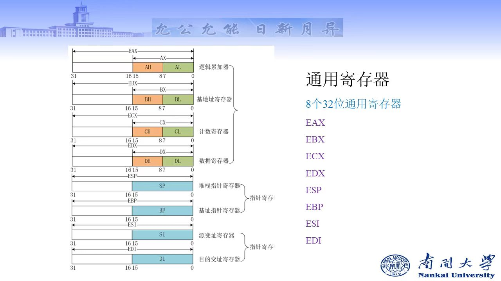

# 汇编语言与逆向工程的基础

> 汇编语言的前置知识点汇总，参考书籍《Intel汇编语言程序设计》
>(*)标注的模块是往年没有的（指2023及以前），可以多加关注
> 本章知识点强调：
>
> + 计算机体系结构：**寄存器**
> + IA 32位处理器体系结构：**保护模式**、**EFLAGS寄存器**
> + IA 32的内存管理：**段模式**，**页模式**

## Part00 汇编语言认知

### 什么是汇编语言

计算机编程语言包括：汇编语言、机器语言、高级语言

汇编语言称为**符号语言**，用**助记符**代替机器指令的操作码，用**地址符号或标号**代替指令或操作数的地址

### 汇编语言的优缺点

+ 优点：高速度、高效率，能够深刻地对软件程序进行分析
+ 缺点：
（1）**学习难度高**：需要了解系统和硬件的知识
（2）**可移植性差**：不同CPU架构、指令集存在差异
（3）**复杂**：程序较长、结构松散

### 汇编语言应用场景

嵌入式系统、实时系统、游戏机、驱动程序、加密算法、逆向分析

### 汇编语言之于虚拟机（*）

+ 第五层：高级语言
+ 第四层：汇编语言：助记符
+ 第三层：操作系统：定义交互命令的虚拟机
+ 第二层：指令集体性结构：固化在处理器上的内部的指令集
+ 第一层：**微结构**：芯片上特殊的微指令结构
+ 第零层：数字逻辑

程序执行层次：

+ **翻译方式**：高层虚拟机的程序被整体翻译成底层的虚拟机程序，然后在底层虚拟机上执行
+ **解释方式**：低层虚拟机对高层虚拟机程序，逐条指令进行解码并执行

### 汇编语言中数据的表示、存储方式

二进制数：

+ 最**左**边的位称为最高有效位(**MSB**)
+ 最**右**边的位称为最低有效位(**LSB**)

!!! Note "常用存储单位思辨:
    + 字节（Byte） 包含8个bit位
    + 字（word） 包含2个**字节**
    + 双字（doubleword） 包含2个**字**
    + 八字节 （quadword）包含2个**双字**

    $$1kB = 1024byte,1MB = 1024kB$$ $$1GB = 1024MB,1TB = 1024GB,1PB = 1024TB$$

!!! Note "字节序"
    表示数据在存储器中的存放顺序

    + 大端字节序：一般意义上的顺序存储（最高位存储在低地址）
    + 小端字节序：一般意义上的逆序存储

    Windows使用的是**小端字节序**

## Part01 计算机体系结构

### CPU

+ 寄存器：数据存储，数量有限
+ **时钟：同步CPU内部操作**
每个时钟周期CPU完成一步操作，时钟频率 = 1/时钟周期。
+ 控制单元**CU**：控制机器指令的执行步骤
+ 算术逻辑单元ALU：算数运算、逻辑运算

!!! Note "在CPU中执行单条机器指令的执行包括一系列操作"
    + 取指令
    + 解码：控制单元CU确定执行什么操作
    + 取操作数：从内存中读操作数
    + 执行：ALU中执行
    + 存储输出操作数：向内存中写入

### 内存存储单元MSU

存放指令和数据的地方

## PART02 IA-32处理器

### 工作模式

+ 实地址模式：16位，8086程序设计环境

系统刚启动时一般是实地址模式，从段寄存器直接拿取起始地址。
此时，物理地址是20位的，因为有20条地址线，可存储空间1MB。

16位寄存器如何兼容?此时，机器使用一个段选择器（通常是一个段寄存器）和一个偏移地址相结合产生一个20位的物理地址。

<center>
物理地址（20） = 16位段地址 << 4（即*16）+16偏移地址
</center>  

+ 保护模式：32位、IA-32程序设计环境

32位的寻找地址的上限是有**4GB的地址空间**。同时是一个**多任务**的操作系统。同时也提供了虚拟8086模式，兼容旧的8086程序。

### 处理器寄存器结构

```diff
+-------------------------+
|    段寄存器 (CS, DS, ...)    |
+-------------------------+
|     通用寄存器 (EAX, EBX, ...)   |
+-------------------------+
|     特殊寄存器 (PC, IR, Flags)   |
+-------------------------+

```

#### 段寄存器

通常在寄存器组的一部分，数量有限，位置固定。它们主要用于存储段的基地址，帮助CPU计算物理地址

+ CS：Code Segment
+ SS：Stack Segment
+ DS、FS、GS：Data Segment
+ ES：Extra（Data）Segment

#### 通用寄存器



#### EFLAGS寄存器

!!! Tip "带E的寄存器"
    例如，**E**FLAGS寄存器(状态标志，是If、while在CPU上实现的硬件)，是一个由16位扩展出来的32位寄存器。

**零标志（ZF）**：

**进位标志（CF）**：

**溢出标志（OF）**：

**符号标志（SF）**：

**奇偶标志（PF）**：

**辅助进位标志（AC）**：

**方向标志（DF）**：

**指令指针寄存器（EIP）**：

### 内存管理

IA-32保护模式下的内存管理的模式比较复杂，包括段模式、页模式。

**段模式**：段是一段连续的内存空间，一般来说，保护模式的程序有3个段（代码段CS，数据段DS，堆栈段，SS）

段基址加偏移寻址的操作：Segment Offset

段选择子（Segment Selector），用于索引GDT和LDT中的表项

+ **index(13'bit)** 表索引，最大8192
+ **TI(1'bit)** 0是GDT，1是LDT
+ **PRL(2'bit)** Request Privilege Level，段的访问权限，包括0和3两个取值
**「Ring0 ： Kernel Mode； Ring 3 ：User Mode」**

!!! Note "段机制的缺点"
    会产生较多的内存碎片

