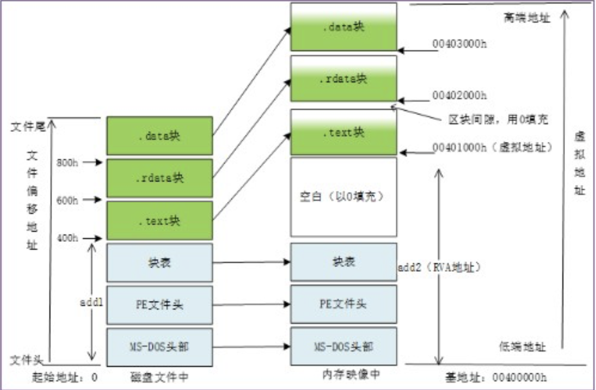

# PE文件结构

> 本章节知识点强调：
>
> + 可执行文件
> + **PE文件基本概念**：虚拟地址空间、相对虚拟地址
> + **DOS文件头**：MZ头、定位PE头
> + **PE文件头**：AddressEntryPoint、ImageRase、数据目录
> + **节**：文件偏移RAW到内存地址RVA的转换方法
> + **导入表**：INT、IAT
> + **导出表**：AddressOfNames，AddresssOfNAmeOriginals,AddressOfFunctions

!!! Tip "关于PE文件存储的形式 - 小端序"
    在PE文件存储采用的是小端序存储方式，例如我要存储这个字段“50450000”，在内存中的值是“00‘00’45‘50”

## 可执行文件

可执行文件 (executable file)
• 可以由操作系统进行加载、执行的文件
• 在不同的操作系统环境（Windows、Linux、MacOS）下，可执行文件的格式不一样
• 二进制文件，不同于txt、word、excel等文本文件

Windows系统可执行文件使用PE文件格式，
Linux系统可执行文件使用ELF文件格式。

在Windows操作系统下，可执行程序可以是.com文件、 .exe文
件、 .sys文件、 .dll文件、.scr文件等类型文件

!!! Note "各种可执行文件的类型解释"
    + .sys - 通常在Windows操作系统中使用，主要用于**存储设备驱动程序或与系统硬件、软件交互的系统配置**
    + .scr - **屏幕保护程序文件**，常用于Windows操作系统。
    + .dll - DLL文件中存放的是**各类程序的函数(子过程)实现过程**，当程序需要调用函数时需要先载入DLL，然后取得函数的地址，最后进行调用。

### .com文件

.com文件在IBM PC早期出现，格式主要用于**命令行应用程序**、最大**65,280字节**。与MS-DOS操作系统的可执行文件兼容

### .exe、.dll、.sys可执行文件

.exe,.dll,.sys文件使用的是PE文件结构

!!! Note "什么是PE"
    PE（Portable Executable File Format）可移植可执行文件结构,PE文件是Windows下可执行文件的总称。
    理解PE文件结构是逆向技术的基础

### ELF可执行文件

静态链接器会以链接视图解析ELF文件，动态链接器会以执行视图解析ELF文件并动态链接。

## PE文件基本概念

PE文件使用的是线性地址空间
所有代码和数据都在一个地址空间，组成PE文件
文件内容被分割为不同的**节**(Section，也叫做块、区块、段等)

### 节

代码节、数据节
• 各个节按页边界对齐（4096Bytes）
• 节是一个连续结构，没有大小限制
• 每个节都有自己的**内存属性**

### 虚拟内存地址空间

每个程序都有自己的虚拟内存地址空间，虚拟空间的内存地址称为虚拟地址(Virtual Address，VA)
• 4GB
• 不同进程的虚拟地址空间是相互隔离的

### 模块

当PE文件通过Windows加载器载入内存后，内存中的版本称为模块(Module)
• 映射文件的起始地址称为模块句柄( hModule )
• 初始内存地址也称为基地址( ImageBase )

内存中的模块代表进程将这个可执行文件所需要的代码、数据、资源、输入表、输出表及其它有用的数据结构都放在一个连续的内存节中

### 相对虚拟地址

> 使用相对虚拟地址的原因：
>
> 1. 模块的地址冲突问题 - 模块的加载顺序和加载地址是不确定的
> 2. 在可执行文件中，有许多地方需要内存地址
> 3. PE文件有一个首选的载入地址(基地址)，并且PE文件可以载入到进程空间任何地方

• RVA是**相对于PE文件载入地址的偏移位置**

假设一个EXE文件从00400000h处载入内存
代码节起始地址为401000h，代码节起始地址的RVA计算方法如下:
目标地址401000h - 载入地址400000h = RVA 1000h

• 将RVA转换成虚拟地址VA的过程
用实际的载入地址ImageBase加相对虚拟地址RVA
虚拟地址(VA)=基地址(ImageBase)+相对虚拟地址(RVA)

## DOS文件头

每个PE文件都是以一个16位的DOS程序开始的，**DOS MZ头与DOS stub**合称为DOS文件头
DOS开头是一个Magic-Number:5A4D

## PE文件头

PE文件头(PE Header)紧跟在DOS stub的后面，``IMAGE_DOS_HEADER``结构的``e_lfanew``字段定位PE Header的起始偏移量，加上基址，得到PE文件头的指针
$$PNTHeader = ImageBase+DosHeader->e\_lfanew$$

### Signature

在一个有效的PE文件中，Signature的字段的值是"00004550h"（**注意不要丢掉h后缀**）
对应的ASCII字符是如下：“PE\0\0”

### FileHeader

+ Machine：可执行文件的目标CPU类型
+ NumberOfSections：记录节(Section)的数量
+ TimeDateStamp：文件的创建时间
+ Characteristics(类似于EFLAGS)：字段用于描述文件的属性

### Characteristic

## 节

### 节表

!!! Note “为什么要使用节（section）”
    简单来说，就是为了保证程序的安全性，把code和data放在同一个内存节相互纠缠，**很容易引发安全问题**。code有可能被data覆盖，导致程序崩溃。

PE文件格式将**内存属性相同**的数据统一保存在一个被称为“节”（section）的地方。然后节表包括：

+ Name（8Byte）：块名

+ VirtualSize（DWORD）：在内存空间中节的大小

+ VirtualAddress（DWORD）：节在**内存空间**的起始**RVA**
+ SizeOfRawData（DWORD）：该节在**硬盘**中所占的空间
+ PointTORawData（DWORD）：该节在**硬盘**中的偏移

!!! Note "注意节在内存中的存储地址"
    节在内存中的存储地址是——**相对虚拟地址**。

### 节的内存属性

关于块的属性：

+ 2000‘0000h，可执行
+ 4000‘0000h，可读
+ 8000’0000h，可写

### 节的内容

+ 0000‘0020h，包含可执行代码
+ 0000’0040h，包含已初始化的数据
+ 0000‘0080h，包含没有初始化的数据

### 文件偏移与虚拟内存地址转换

我们记文件偏移量是RAW,记虚拟内存地址RVA:

$$RAW - PointerToRawData = RVA - VirtualAddress$$

## 导入表IAT