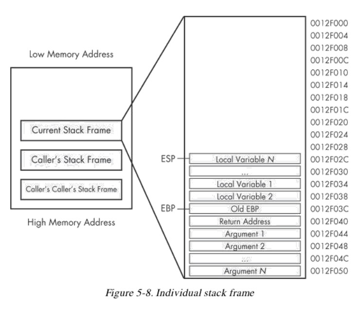
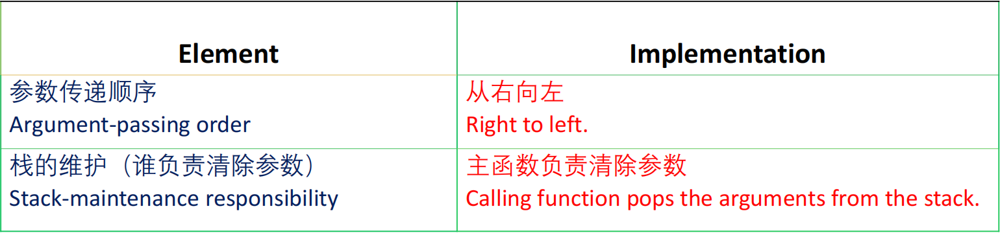
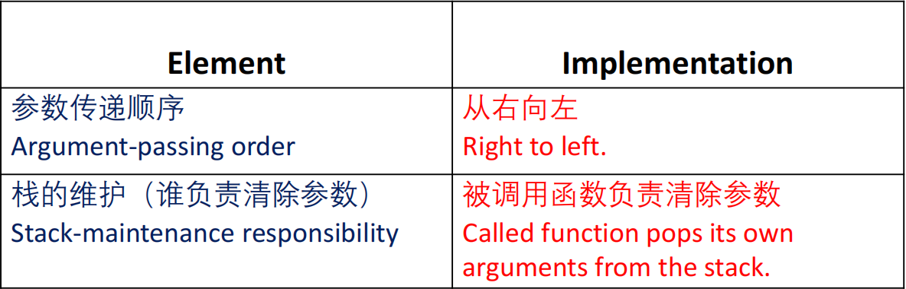
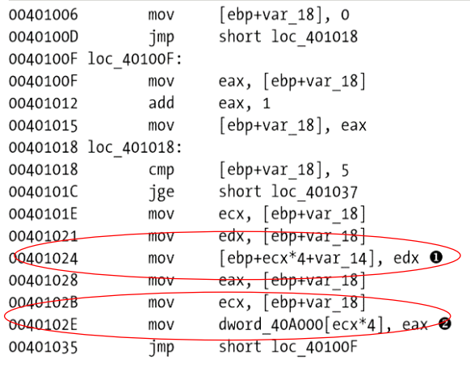
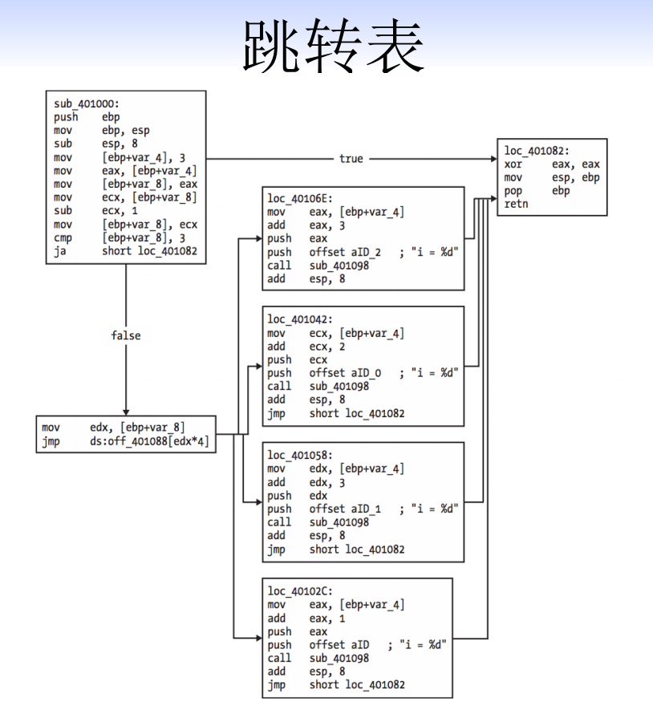
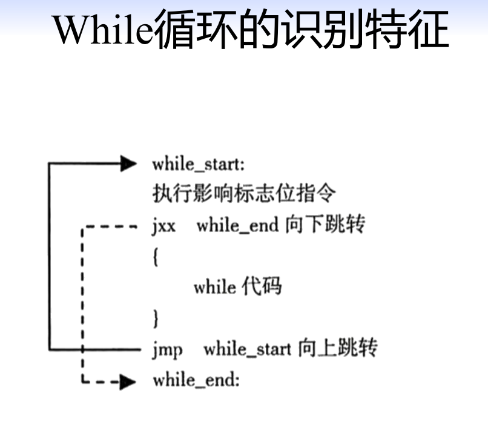
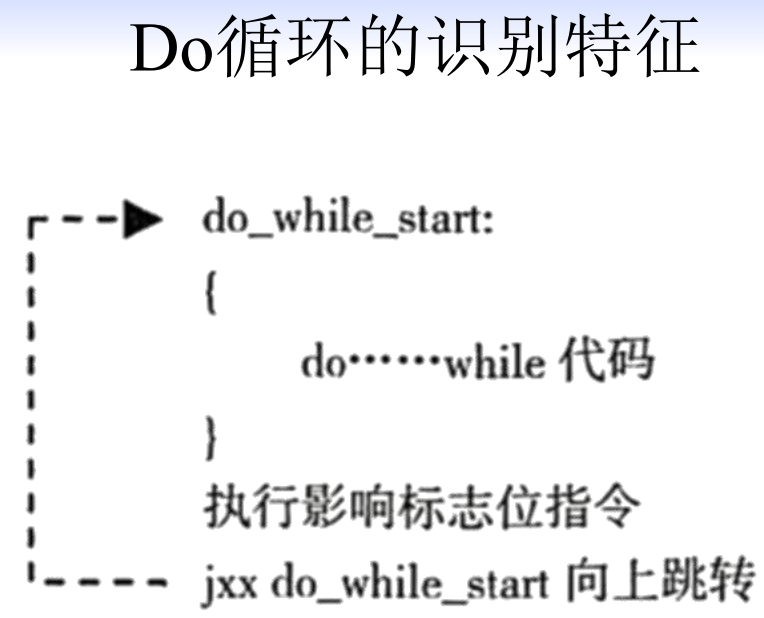

# C语言逆向分析

## 识别函数

### 启动函数

在编写Win32程序的时候，在源代码中都有一个WinMain函数。Windows程序的执行并不是从WinMain函数开始的，而是先执行启动函数。（从EXE文件的角度说，EXE文件的Entry Point是一段启动函数的代码）

+ 启动函数是由**编译器**生成的。
+ 启动函数完成初始化进程后，才会执行WinMain函数。

启动函数的作用：

1. 检索指向新进程的命令行指针
2. 检索指向新进程的环境变量指针
3. **全局变量**初始化
4. **内存栈**初始化

### 函数（Call）

函数调用使用Call指令。
Call指令的常见操作码是E8，操作数是32位有符号的相对位移，相对于EIP的寄存器的值。Call指令的地址是：``opcode +  EIP``

**计算Call指令对应的函数的入口地址**
• call指令的内存00401492h
• 下一条指令的地址是00401492h+5 = 00401497h
• call指令的操作数是一个有符号相对位移值0fffffb87h（符号位）
• j_scan函数的入口地址是00401497h + 0fffffb87h = 1**0040101Eh**

### 栈（一定是考点！！）

> 函数的参数如何传递、局部变量如何定义、函数如何返回

（重要考点）函数的调用过程：

**传入参数**：通过Push指令将参数压入栈中
**保存返回值**：call Memeory_location - call的返回地址压入栈中，并且修改EIP的值
**保存栈帧**：push ebp,mov ebp,esp;
**创建局部变量**：add esp xxx(xxx是局部标量占用的空间，然后在栈中分配变量的空间)



函数的执行、返回过程：
（1）执行函数
（2）清除**局部变量**占用的栈空间  -- **“LEAVE指令”**
（3）ret指令从栈中读取返回地址，设置EIP
（4）清除**参数**占用的栈空间

```Assembly
; LEAVE指令做的的事情
mov esp,ebp ;结合栈帧的图，你就知道这个步骤清楚了局部变量
pop ebp ;返回到old Ebp中


```

**“RETN指令”---（3）（4）**

### 函数调用约定

下面我们列举x86上的一些常见的调用约定：

+ 在x86平台，函数所有参数的宽度都是32bits
+ 函数的返回值的宽度32bits，并且存储在EAX中

调用约定是**被调函数callee和主函数caller如何传递参数和返回值的约定**。

``__cdecl``是 C and C++ 程序的标准函数调用

一般来说在逆向中调用的格式如下：

```Assembly
call _sprintf 
add esp,10;遵循的是_cdecl函数调用约定,主函数负责清楚参数
```



``__stdcall`` 是Win32 API 函数的调用约定

```Assembly
call ds:SetFilePointer 
mov ebx，eax;遵循的是_stdcall函数调用约定
```



## 识别变量、数组、结构体

### 全局变量、局部变量

在逆向分析中，我们需要知道局部变量的样子，全局变量的样子

```Assembly
mov eax, [ebp+var_4]
;[ebp+var_4] 这是一个局部变量的样子

mov eax,dword_4oCF6o
; dword_4oCF6o 这是一个全局变量的样子
```

### 数组

数组是相同数据类型的元素的集合，它们在内存中按顺序连续存放在一起。

+ 数组元素的地址=数组首地址+ sizeof(元素类型)*索引值



注意，数组是局部变量还是全局变量

### 结构体

好像没有什么考点

## 识别IF分支结构

在逆向分析中，我们识别IF结构的一个重要标志是，IF语句的识别特征，jxx的跳转和一个无条件jmp指令。

## 识别Switch结构

Switch结构用来实现基于字符或者整数的决策。
Switch结构通常以两种方式被编译：（1）IF结构（2）使用跳转表  



## 识别循环

### FOR循环

FOR循环有4个组件：
• 初始化
• 比较
• 指令执行体
• 递增或递减

### While循环



### Do循环

