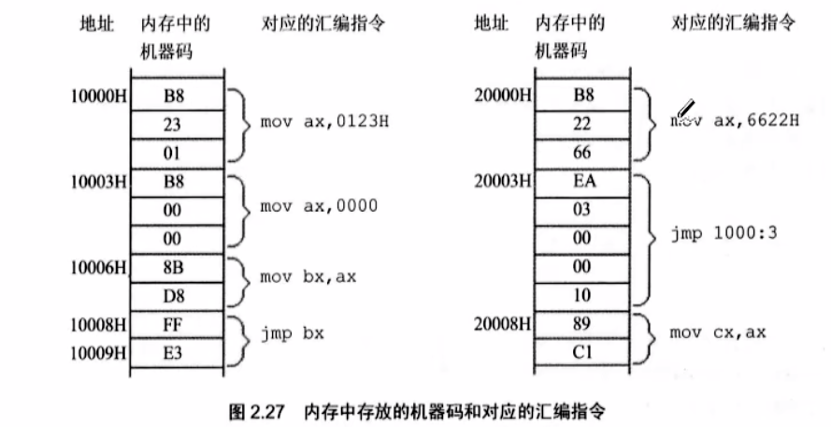
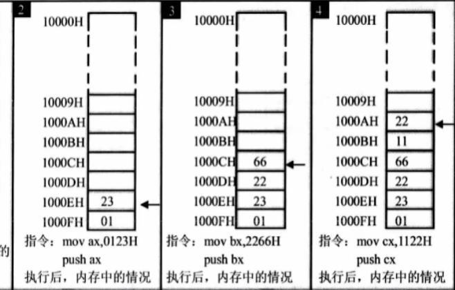
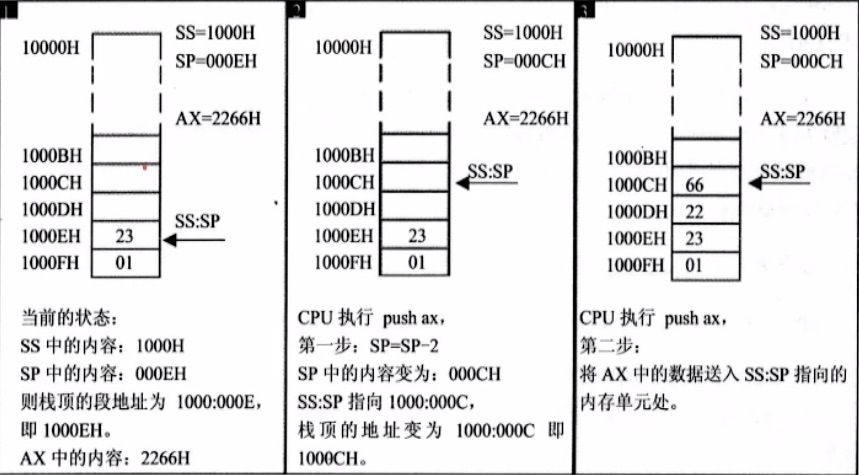
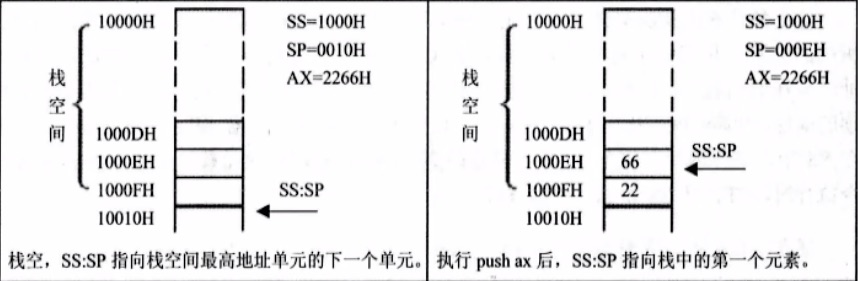
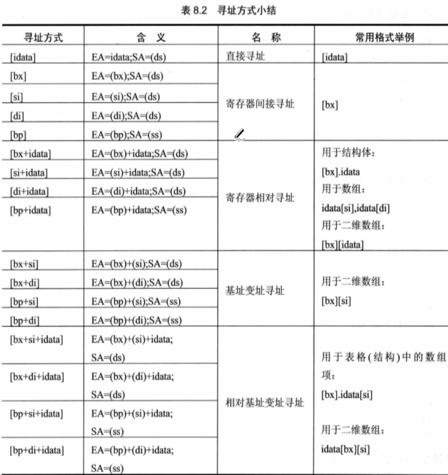

# 编译环境使用

## Debug功能

+ R命令``-r``（Register）：查看、改变CPU寄存器的内容
+ D命令``-d``（Dump）：查看内存中的内容
+ E命令``-e``（Edit）：改写内存中的内容
+ T命令``-t``(Trace)：执行一条机器指令
+ A命令``-a``(Assemble)：以汇编指令的格式在内存中写入一条机器指令
+ U命令``-u``(Unassemble)：将内存中的机器指令翻译成汇编指令

## mov、add、sub指令

+ ``mov ch,10``：将高八位覆盖前两个：CX：0000 --t--> CX：**10**00 (默认是十六进制显示)
具体的过程如下：CX:0000 0000 0000 0000 --t--> CX:**0001** **0000** 0000 0000

!!! Summary "关于寄存器的小总结"
    ``ch`` - cx寄存器的高八位 - c,high
    ``bl`` - bx寄存器的低八位 - b,low

+ ``add bx,ax``：等价于``bx = bx + ax``

特别地，我们会谈及关于寄存器加法溢出的问题，设此时``cx = E0DE``

+ ``add cl,86``操作后，对于``DE+86 = 194``但是溢出的1不会保存到cx的第三位（16进制显示）
所以最后的结果是``cx = E094``

同理这样对于``sub``借位的机制等价于这里对于溢出位的处理机制。

## 寄存器

+ AH&AL = AX(accumulator)：累加寄存器
+ BH&BL = BX（Base）：基址寄存器
+ CH&CL = CX（count）：计数寄存器
+ DH&DL = DX（data）：数据寄存器
+ SP（Stack Pointer）：堆栈指针寄存器
+ BP（Base Pointer）：基址指针寄存器
+ SI（Source Pointer）：源变址寄存器
+ DI（Destination Index）：目的变址寄存器
+ IP（Instruction Pointer）：指令指针寄存器
+ CS（Code Segment）：代码段寄存器
+ DS（Data Segment）：数据段寄存器
+ SS（Stack Segment）：堆栈段寄存器
+ ES（Extra Segment）：附加段寄存器
  
下面介绍一些常用的标志位：

+ OF（overflow Flag） 溢出标志 操作数超出机器能表合适的范围表示溢出，溢出时为1。
+ ZF（zero Flag）零标志，运算结果等于0时为1，否则为0
+ SF（sign Flag）符号标志 记录迅速按结果时候的符号，结果为负时为1
+ CF（carry Flag）进位标志 最高有效位产生进位时为1，否则为0
+ AF（Auxiliary carry Flag）辅助进位标志，运算时候第三位向第四位产生进位为1，否则为0
+ PF（parity flag）奇偶标志，匀速拿结果操作数位为1的个数为偶数个时为1，否则为0
+ DF（direction flag）方向标志，用于串处理，DF = 1时，每次操作后使SI和DI见效，DF = 0时则增大
+ IF（interrupt flag）终端标志，IF = 1时，允许CPU相应可屏蔽中断，否则关闭中断
+ TF（trap flag）陷阱标志，用于调试单步操作

## mul、div、and、or指令

+ ``mul``：两个相乘的数，要么都是8位，要么都是16位，**如果是8位，默认放在AL中**，另一个放在8位reg或者内存字节单元中；**如果是16位，一个默认放在AX中，**另一个放在16位reg或者内存单元中。
+ 结果，如果是8位乘法默认放在AX中；如果是16位乘法，结果高位默认放在DX中，低位放在AX中放

```Assemble
mov ax,64h //这里显示的是十六进制
mov bx,2710h
mul bx ;这里等价于ax = bx*ax
```

+ ``div``：除法指令
+ （1）除数：有8位和16位两种，有一个在reg或内存单元
+ （2）被除数：**如果除数位8位，被除数就是16位，默认存放在AX**；如果除数为16位，被除数则为32位，在DX和AX中存放，DX存放在高16位，AX存放低16位。
+ （3）结果：如果除数为8位，则AL存储出发操作的商，AH存储除法操作的余数。同理可推出除数为16位的情况


+ ``and``：逻辑与：按位进行与运算
+ ``and al,00111011B``按位与运算后保存在al中。
同理对于``or``运算，我们不多解释

## shl和shr指令

+ shl(shift left) 左移指令
+ shr(shift right) 右移指令

!!! Tip "注意循环左移(rol)和普通左移（shl）、循环右移（ror）和普通右移的区别"

## dec和inc指令

+ ``dec ax``等价于C++中的``ax--``
+ ``inc ax``等价于C++中的``ax++``

## NOP和XCHG、NEG指令

+ ``NOP``空指令，相当于占位指令。方便前面的代码交换到空的 地方
+ ``xchg ax,bx``交换元素指令
+ ``neg ax``对ax取负数（先去反码）

## 常见int中断指令

这个中断指令的起源可以从保证``div``除法指令有意义并且进行正确除法的方法。

+ ``int 0``：除数不能为0的中断指令
+ ``int 21``：程序正常退出的指令

## 段地址*16+偏移地址=物理地址的本质含义

|物理地址|段地址|便宜地址|
|:---:|:---:|:---:|
|21F60H|2000H|1F60H|
|-|2100H|0F60H|
|-|21F0H|0060H|
|-|21F6H|0000H|

本质含义可以看到下图：


## DS和[address] - 内存读取

注意:[...]表示的是一个内存单元，然后"[0]"表示内存单元的偏移值为0。

现在我们要访问数据的段地址，比如我们要读取10000H单元的内容，可以使用如下的程序段进行。

```Assemble
mov bx,1000H
mov ds,bx ;不能直接操作mov ds,1000H,不能使用立即数
mov ax,[0]
```

在本小节中，我们需要学会从物理内存中读取数据的方式，并且注意到Windows小端序的存取的特点。然后学会使用通过DS寄存器来读取内存的数据。最后你需要知道这个物理地址的含义，以及上面小节中的图片的含义。

!!! Note "高八位、低八位与小端序存取的基本原理"
    我们以CX寄存器的存取为例子，此时CX的状态是：
    ``CX = 0000``,并且``DS = 2000``然后我们在内存中``2000:0000 B8 23 01 BB``读取数据，执行``mov CX,[1]``然后得到``CX = 01 23``

    为什么呢？这其实很自然。
    01是CX的高位，所以对应着内存地址中的高八位；
    23时CX的低位，所以对应着内存地址中的低八位；

## CS和IP段寄存器和jmp指令

CS是段地址，IP是偏移地址，用来去读取内存中的指令并且执行。其实你实践过后发现其实很简单，代码和数据其实不加以区分存储在内存中。



参考上面的图片，我们能够认知到``jmp``指令的功能和使用。
在``Debug``中，我们可以看到，``jmp``指令的本质是跳转到指定的地址。然后根据CS、IP寄存器的功能，我们能知道:

```Assemble
mov ax,0000
mov bx,ax
;此时CS=1000
jmp bx
;等价于jmp 1000:0000
```

## 栈

我们在这里介绍清楚CPU的栈的机制。

```Assemble
push [0] ;合法
pop [1] ;合法

push ax ;合法
pop bx ;合法

push 1000h ;不合法，不能是立即数
pop 1000h ;同上
```

### 栈的存储机制



我们仍然借用之前小端序原理的解释，“0123H”的存储，“01”是高位，所以对应栈中的高地址“1000FH”，然后“23”的是数据段的低位，所以对应了栈中的低地址“1000EH”

在任意时刻，``SS:SP``指向栈顶的元素



核心步骤： $SP = SP - 2$
执行push时候，CPU的两步操作是：先改变SP，然后向SS:SP处传送。

如果是需要从栈中POP出元素



核心步骤就是： $SP = SP + 2$
执行pop时候，CPU的两步操作时，先读取SS：SP的数据，后改变SP。

### 栈的越界问题

压栈，弹栈都有可能导致栈顶越界的问题，因为栈的范围是人为确定的（对于8086CPU而言）

## [bx+idata]

我们发现，我们可以使用[bx]来指明一个内存地址，而其他的寄存器不能有这个功能。

```Assemble
-e 1000:0000 00.12 00.34 00.56 00.78 00.AB

mov bx,1002
mov cx,[bx+1]

- d 1000:1002
```

## [SI],[DI]

记住，**一般来说，``[]``的功能就是偏移地址**
同样的SI、DI是8086CPU中和bx功能相近的寄存器。用来寻找地址。

下面的三段代码实现了相同的功能：

```Assemble
mov bx,0
mov ax,[bx]
```

```Assemble
mov si,0
mov ax,[si]
```

```Assemble
mov di,0
mov ax,[di]
```

于是，我们**通过 [bx+si],[bx+di],[bx+si+idata],[bx+di+idata] 实现**更加灵活的寻址方式，可以用于**循环寻找地址**等方式。

!!! Tip "易错点"
    1. ``mov cx,[bx+si+di+1]``是**错误**的，``si``和``di``寄存器不能同时使用。
    2. ``mov [bx+si+1],cx``是**正确**的，``[bx+si+1]``的本质是一个内存单元，当然可以这样执行，之前我们执行过``mov [1],cx``是可以的，在这里也是类似的。

## [bp]

只要在[...]中使用寄存器bp，如果指令中没有显性给出段地址，**段地址就默认在ss中**，比如在下面的指令：

```Assemble
mov ax,[bp] ;等价于(ax) = ((ss)*16+(bp))
```

## 寻址的方式小结



## 标志寄存器

一般来说，运算或者逻辑操作才会改变标志位，数据传送不改变标志位。

### ZF标志（zero Flag）

```Assemble
mov ax,2 
sub ax,1 ;结果为0，ZF=1，表示“结果为0”
add ax,1 ;结果为1，ZF=0，表示“结果非0”
```

注意，关于数据传送类指令``mov,push,pop``的结果不算在ZF的检测中。

### PF标志

flag的第二位是PF，名称为奇偶标志位。它记录相关指令执行之后的，其结果总所有的Bit为中1的个数是不是偶数。如果1的个数为偶数，pf = 1，如果为奇数，那么为0.

同样的，PF标志位的检测对数据传送类指令``mov,push,pop``的结果**无效**。

### SF标志（sign Flag）

在计算机的存储中，一个数字可能是原码存储在计算器中，也可能是补码存储在计算器中。

例如，10000001B，可以看作是无符号整数129，也可以看作是有符号整数-127。

### CF标志（carry Flag）

CF会记录向高位的借位值或者进位值。

```Assemble
mov al,98H
add al,al ;执行后：（al）= 30H，CF=1，CF记录了向更高位的进位值

mov al,97H
sub al,98H ;执行后：（al）=FFH，CF=1，CF记录了向更高位的借位值。
sub al,al ;执行后：（al）= 0，CF = 0，CF记录了向更高位的借位值。
```

### OF标志（over Flag）

有符号运算的结果超过了机器所能表示的范围称之为**溢出**。8位有符号整数的表示范围：-128~127。

!!! tip "OF和CF的一些区别漫谈"
    CF针对**无符号数**(将寄存器中的操作数都看作是无符号数)
    OF针对**有符号数**(将寄存器中的操作数都看作是有符号数)

    98的十六进制 --62，同理98
    ```Assemble
    MOV al,62
    MOV bl,63
    add al,bl
    ```
    这两个数相加并没有进位但是发生了溢出。

    具体可以参考这篇文章理解清楚：[标志位寄存器与CF、OF标志位的区分 - CSDN](https://blog.csdn.net/apollon_krj/article/details/71239549)

其他的Flag寄存器不常用，我们就不一一介绍啦。详情可以参考笔记开头的记录。需要用到的时候了解下即可

## adc指令

adc是带进位的加法指令，他利用CF位上记录的进位值

指令格式：adc 操作对象1，操作对象2
功能：操作对象1 = 操作对象1 + 操作对象2 + CF

```Assemble
mov ax,1
mov bx,2
sub ax,bx
adc ax,1
```

同时我们给出一个示例程序，显示出这个进位的功能：

```Assemble
mov ax,198
mov bx,183
add al,bl
add ah,bh ;结果是021B，错误，没有传递这个中间进位

add al,bl
adc ah,bh ;结果是031B，正确！
```

**例题**：试一试，我们计算1EF0001000H+2010001EF0H，结果保存在ax(最高16位)，bx（次高十六位），cx（低16位）中

## sbb指令

sbb类似上面的adc，带借位减法指令，它利用了CF上记录的借位值。基本上思想与上面相同，我们不再次赘述。

## cmp指令

cmp是比较指令，cmp的指令的功能相当于减法指令，只是不保存结果。cmp指令执行之后将会对标志寄存器产生影响。

```Assemble
cmp ax,bx ;等价于观察(ax)-(bx)
```

如果你标志位学习的比较好，那么下面的的结果将会看起来很自然：

|cmp  ax,bx|标志位的变化|
|:---:|:---:|
|ax = bx|zf = 1|
|ax != bx|zf = 0|
|ax < bx|cf = 1|
|ax >= bx|cf = 0|
|ax > bx|cf = 0并且zf = 0|
|ax <= bx|cf = 1 或者 zf = 1|

那么我们继续给出对无符号数的比较结果进行转移的条件跳转指令：

|指令|英文对应|含义|标志位|
|:---:|:---:|:---:|:---:|
|je|jump if **equal**|等于跳转|zf = 1|
|jne|jump if **not equal**|不等于跳转|zf = 0|
|jb|jump if **below**|小于跳转|cf = 1|
|jnb|jump if **not below**|大于等于跳转|cf = 0|
|ja|jump if **above**|大于跳转|cf = 0并且zf = 0|
|jna|jump if **not above**|小于等于跳转|cf = 1或者zf = 0|
