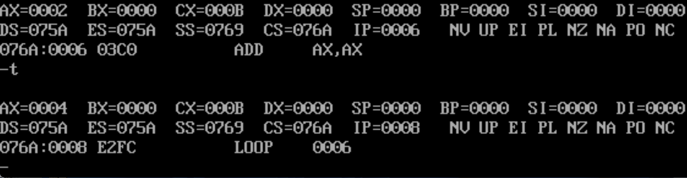
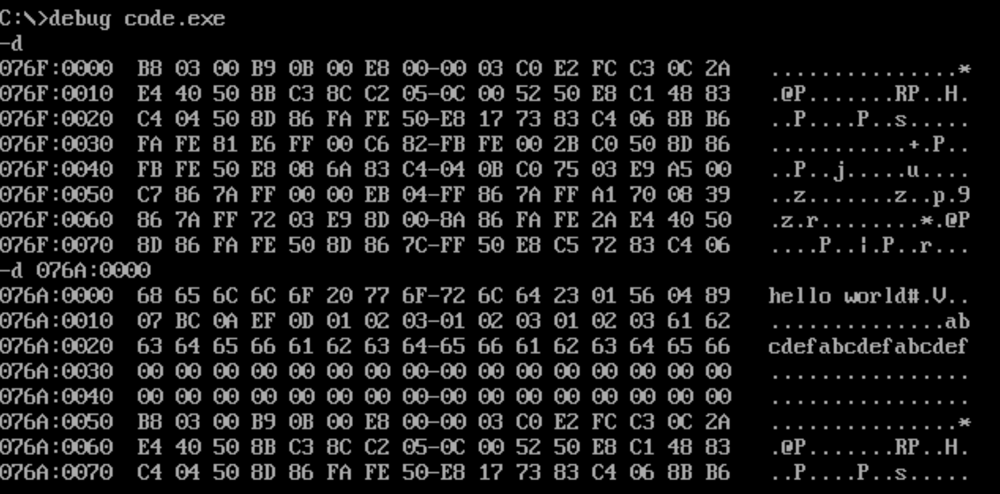
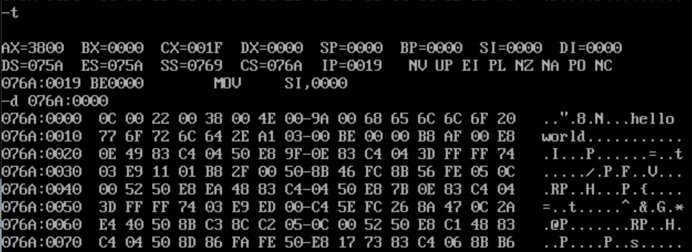

# 汇编程序框架实现

## LOOP指令 - 循环框架的开始

LOOP指令的格式是：LOOP 标号
CPU执行LOOP指令的时候，要进行两步操作：
（1）cx = cx - 1
（2）判断cx中的值，不为0则跳转至标号处执行程序，如果为0则向下执行

通常来说，我们用**Loop指令实现循环功能**，**cx中存放循环次数**。

LOOP的本质就是改变了``IP``寄存器



```Assemble
assume codesg
codesg segment:
    mov ax,2
    mov cx,11 ;这里会执行11次，一个比较重要的细节，所以答案是11
    s:
        add ax,ax
        loop s
    int 21 ;退出程序的意思
codesg ends
end
```

!!! Error "易错点强调"
    上面的程序中的循环次数讨论，
    + 当cx = 0时候，循环会执行10000H次！**而不是0次！**
    + 当cx = 1时候，循环会执行1次

在DOSBox中的Debug模式中，我们可以使用``p``（pass）指令直接跳过即将要执行的循环或者直接运行结束当前的循环。

**本小节例题**：*请使用循环实现1+2+3+...+100的汇编程序（回想一下C++的版本可能会有助于你解决这个问题）*

## 函数call、ret指令

我们利用``call``,``ret``两个指令对某一个过程进行封装函数，然后我们对上面的计算2的12次方的过程封装成函数：

```Assemble
assume cs:codesg
codesg segment:
    mov ax,2
    mov cx,11
    call s
    int 21H

    s: ;封装为函数
        add ax,ax
        loop s
        ret
codesg ends
end
```

!!! Tip "Ret和Retf"
    + ``ret``指令用于栈中数据，修改IP的内容，从而实现近转移
    + ``retf``指令用于栈中的数据，**修改CS和IP的内容**，从而实现远转移

    ``retf`` = return far，就是转移到远地址的意思

CPU执行``call``指令时，进行两步操作：
（1）将当前的IP或CS和IP**压入栈**中，SP = SP - 2；「一般是call语句后面那个语句的IP」
（2）转移

那么当CPU执行``ret``指令时，进行两步操作：
（1）**弹出来栈并放入IP**,SP = SP +2
（2）转移执行

同理，我们可以将上面的代码修改为``call far ptr``和``retf``的版本。本质上就是转移地址就是加入了**段地址**。一般来说使用这个语句的背景就是你需要调用一个存储在其他段上的进程。

```Assemble
assume cs:codesg
codesg segment:
    mov ax,2
    mov cx,11
    call far ptr s ;call 一个“段地址+偏移地址”
    int 21H

    s: ;封装为函数
        add ax,ax
        loop s
        retf ;转移到远地址
codesg ends
end
```

**本小节例题**：如果你理解了``ret``的机制，那么你就知道，即使在代码段中没有``call``但是也有``ret``是**不会报错的**，并且也能正常进行，请你想想下main的程序。同理，你想想有``call``没有``ret``的情况

```Assemble
assume cs:codesg
codesg segment:
    mov ax,2
    mov cx,11
    ret ;单独的一个ret，会发生什么？请思考
    call s
    int 21H
codesg ends
end
```

## 代码段

### 在代码段中使用数据

在代码段中定义数据，数据会被保存到CS：IP地址中，可能会影响代码的正常执行。同时在代码段中定义数据需要注意立即数的位数是否和数据类型的位数是否匹配。

```Assemble
assume cs:code
code segment
    dw 0123h,0456h,0ABCH ;主义十六进制数字不能以字母开头，会报错

    start:  ;这样在编译阶段不会链接错误，添加上start不会影响正常代码的进行
    mov ax,3
    mov cx,11
    call s
    inc bx
    inc bx
    int 21H

    s:
    add ax,ax
    loop s

code ends
end start
```

!!! Question "在代码段开始位置的定义的这些数据在哪里"
    以上面的程序为例子，由于他们在代码段中，程序在运行的是CS中存放的代码段的段地址，所以可以从CS中得到他们的段地址。所以程序运行的时候他们的地址为如下三个地址：``CS:0``,``CS:2``,``CS:4``

### 在代码段中使用栈

基本上你理解了栈的运行机制，那么在代码段中使用栈的原理你也能够很快地理解清楚。

```Assemble
assume cs:codesg
codesg segment
    dw 0123h,0456h,0789h,0abch,0fedh,0cbah,0987h
    dw 0,0,0,0,0,0,0,0,,0,0,0,0,0,0,0 ;用dw定义了16个字型数据用来当作栈使用

    start:
    mov ax,cs
    mov ss,ax
    mov sp,30 ;将栈顶ss:sp指向cs:30

    s:
    push cs:[bx]
    add bx,2
    loop s ;将上面代码段0-15单元中的8个字型数据放入栈中

    mov bx,0
    mov cx,8

codesg ends

```

## 数据段

MASM内部一数据位的个数定义了多种的数据类型(位的含义：含有的比特位，就是01的个数)

|数据类型|简记符号|数据位数|
|:---:|:---:|:---:|
|BYTE|db|8位|
|WORD|dw|16位|
|DWORD|dd|32位|
|QWORD|dq|64位|

```Assemble
assume cs:codesg,ds:data,ss:stack
data segment
    dw 123h,456h,789h,0abch
data ends
stack segment
    0,0,0,0,0,0,0,0,0,0 ;思考，这里如果我想开一个200字空间的栈，那是不是我要写200个0，会很麻烦
stack ends

```

## dup指令

``dup``:duplicate,用来定义重复的字节、字、双字、结构等内存缓冲区.

```Assemble
stack segment
    dw 0,0,0,0,0,0,0,0,0,0 
    dw 0,0,0,0,0,0,0,0,0,0
    dw 0,0,0,0,0,0,0,0,0,0
    dw 0,0,0,0,0,0,0,0,0,0
    dw 0,0,0,0,0,0,0,0,0,0
    ;思考，这里如果我想开一个200字空间的栈，那是不是我要写200个0，会很麻烦
stack ends
```

那么为了解决这个问题，汇编语言引入了一个dup工具：

```Assemble
stack segment
    db 10 dup(0)
stack ends
```

由此，我们给出``dup``指令的使用格式:

+ db 重复的次数 dup (重复的字节型的数据)
+ dw 重复的次数 dup（重复的字型的数据）
+ dd 重复的次数 dup（重复的双字型数据）

!!! Error "定义字符串的常见错误"
    注意！在数据段中定义字符串的时候不能是``dw 'hello world'``，因为字符串的每个字符是用'byte'存储的，所以应该是``db 'hello world'``

## 将代码、数据、栈定义为不同的段的深入理解

下面我们对下面的代码进行注释和理解

```Assemble
assume cs:codeesg,ds:data,ss:stack
data segment
    ;以下都是常用的汇编代码的常用指令
    db 'hello world'
    dw 123H,456h,789h,0abch,0defh
    db 3 dup(1,2,3)
    db 3 dup('abc','def')
data ends
stack segment
    ;这里的10是什么含义？十进制的10
    db 10 dup(0)
stack ends
codesg segment
    start:
    mov ax,3
    mov cx,11
    call s

    s:
        add ax,ax
        loop s
        ret
codesg ends
end start
```

我们对这个**重复次数**（原本是10，现在修改为17）进行研究

```Assemble
    db 17 dup(0)
```



然后我们在调试的时候发现栈段至少得是16个字节
并且是16个字节的整数倍。

!!! Question "为什么栈段的大小至少是16个字节并且还是16字节的整数倍"
    这里我们从段地址出发解释，现在我们有两个段：
    ``0010:0000``这是一个段的开始，``0011:0000``这是另外一个段的开始，然后我们从物理地址的计算角度出发可以知道，这两个段之间至少差距16个字节。然后**任意两个段地址之间的差距都是16字节的倍数**。

除了发现栈的地址的分配机制之外，我们还发现三个段其实是连续分布的，在``076A:0000``段这里分布着数据段，在``076A:0030``分布着栈段，在``076A:0050``这里分布着数据段。但是你会一下子反应不过来，这和我在上面这个问题的解释不一样呀？

请回顾``段地址*16+偏移地址=物理地址的本质含义``这一章节的内容：

+ ``076A:0030`` -> ``076D:0000`` ，这两者相互等价
+ ``076A:0050`` -> ``076F:0000`` ，这两者相互等价

这就解释了为什么``CS:IP = 076F:0000``但是在``076A:0050``那里也看到了这个代码段存储的命令。并且也合理地自洽了上面的回答。

同时最后，**我们需要强调**，即使现在是分段书写（但是你应该知道分段的这些都是伪指令），我们也**需要``start:``给``CS:IP``指明代码段正确的开始位置**。

我们再补充一些常见的细节

```Assemble
assume cs:codesg,ds:data,,ss:stack
data segment
    db 12,34
    dw 12,33
    db 'hello world'
data ends
stack segment
    db 10 dup(0)
stack ends
codesg segment
    start:
        mov ax,data ;这里会把数据段的段地址传给ax
        mov bx,stack ;这里会把栈段的段地址传给bx
        mov ax,0AFH
codesg ends
end start
```

## 操作符 offset

操作符 offset在汇编语言中是由编译器处理饿的符号，它的功能是去的标号的偏移地址，比如下面的程序：

```Assemble
assume cs:codesg
codesg segment
    start:
        mov ax,offset start ;相当于mov ax,0
        s: mov ax,offset s ;相当于mov ax,3
codesg ends
end start
```

下面的程序展示了如何将s的命令迁移到s0位置，借助offset操作符

```Assemble
assume cs:codesg
codesg segment
    s:
        mov ax,bx ;这个命令已经知道相当于2个字节
        mov si,offset s
        mov di,offset s0
        mov dx,cs:[si] ;移动到指定的段-偏移地址的用法
        mov cs:[di],dx
    s0:
        nop ;相当于一个空字节
        nop
codesg ends
end s
```

## 编辑器中JMP指令

```Assemble
assume cs:codesg
codesg segment
    start:
        mov ax,0
        ;添加位标记1
        inc cx
        jmp short s
        add ax,1
        add bx,1
        mov cx,2
    s:
        inc ax
codesg ends
end start
```

我们解析这里的``jmp short``指令，会发现他对应的机器码是``EB 09``，而我们在标记1这里添加代码``mov bx,0``后，对应的机器码仍然**保持不变**，这是因为``09``保存的是相对偏移量，下一个要执行的位置加上这个偏移量就是``jmp``的目标跳转位置。

类似地，我们还有一个类似的指令``jmp near ptr``的标号，它实现的是段内近转移，功能实现的是``IP = IP + 16位位移``

!!! Tip "jmp short 和 jmp near ptr 的区别"
    位移 = 标号出的地址 - jmp指令后的第一个字节的地址
    然后他们的不同主要就是位移的范围不同：
    + ``jmp short``是8位位移，位移范围是-128～127
    + ``jmp near ptr``是16位位移，位移范围是-32768～32767

那么如果我们要跳转到更加遥远的地址，我们需要学习下面的指令：

```Assemble
jmp far ptr s
s:
    inc ax
```

对应在机器中机器码是：

```bash
076A:0007 EA0C016A07    JMP     076A:010C
```

在这里我们可以发现``jmp far ptr``与之前的``jmp``段内近跳转并不一样，**存储了明确的要跳转的目标的地址的段地址+偏移地址**。

### 转移地址在内存中的JMP指令

(1) ``jmp word ptr 内存单元地址``（段内转移）
功能：从内存单元地址处开始存放一个字，是转移目的的偏移地址

```Assemble
mov ax,123h
mov ds:[0],ax
jmp word ptr ds:[0]
```

执行之后，(IP) = 0123H

(2) ``jmp dword ptr 内存单元地址``(段间转移)
功能：从内存单元地址处开始存放着两个字，高地址处的字转移的段地址，低地址是转移的目的偏移地址。

结合下面的例子理解这个指令的本质，而这个指令的本质如下：

<center>（CS） = （内存单元地址+2）</center>
<center>（IP） = （内存单元地址）</center>

注意奥，**内存单元地址可用寻址方式的任意一个格式给出就可以**。

```Assemble
mov ax,0123H
mov ds:[0],ax
mov word ptr ds:[2],0
jmp dword ptr ds:[0]
```

执行之后，我们发现：(CS) = 0,(IP) = 0123H,``CS:IP``指向``0000:0123``

## 数组

在汇编语言中，我们通过地址一样能够实现C++中那种指针思想的地址。**但是也有很多不同之处，需要注意**！

```Assemble
data Segment
    arr: dw 12,34 ;这是一种类似于“s:”标号的东西，但是严格意义上这不是数组的定义，但是能够帮助你理解
data ends

codesg segment
    start:
        arr2: dw 12,34
        mov si,offset arr2 ;等价于si = &arr2(C++)但是并不相同
```

上面这个程序中，code、arr、arr2、start都是标号。这些标号仅仅表示了内存单元的地址。

但是，我们还可以使用一些标号，这种标号不但表示内存单元的地址，还表示了内存单元的长度，即表示在此标号处的单元，是一个字节单元，还是字单元，还是双字单元，于是我们对上面的程序进行改写：

```Assemble
assume cs:code
code segment
    arr db 12,34,56,78,9AH
    arr db 'hello world'
    start:
        mov ax,word ptr arr[2]
        ;在这里会因为指针类型的缘故，所以会读入两个元素进入ax
        mov si,offset arr
        mov bx,data
        mob ax,0AFh
code ends
end start
```

!!! Tip "C++中的数组和汇编的数组的辨析"
    + 在汇编语言中，``arr[2]``表示的是``offset arr + 2``，就是``arr``的偏移地址开始然后按照“内存单元长度”读取数据
    + 在C++中，``arr[2]``就是数组中的第二个元素

如果数组的数据类型是``dw``，就要格外小心！

```Assemble
assume cs:code
code segment
    arr dw 12,34,56,78,9AH ;修改类型为dw
    arr db 'hello world'
    start:
        mov ax,word ptr arr[3]；修改为3
        mov si,offset arr
        mov bx,data
        mob ax,0AFh
code ends
end start
```



你以为会读取“0038”,但是你仔细一想，不对，按照辨析中的格式，应该是``3800``才是正确的答案。

借助这个**特别的标号**，我们可以**在其他的段中使用数据标号**，但是需要注意：

!!! Tip "在代码段中使用数据标号访问数据的注意事项"
    使用伪指令``assume``将标号所在的段和一个段寄存器联系起来，同时把data的段地址在code中赋值给ds寄存器
    ```Assemble
    aassume cs:code,ds:data ;必须有
    data segment
        arr db 10h,20h,30h,40h
    data ends
    code segment
    start:
        mov ax,data ;必须有
        mov ds,ax ;必须有
        mov al,arr[2]
        ;这个其实就相当于mov si,offset arr
        ;以及mov al,ds:[si+2]
    code ends
    end start
    ```

同样地，我们不仅仅能读取数组中的元素，还可以写入一些元素。

那么操作就是

```Assemble
mov word ptr arr2[2],ax
```

注意存储的机制仍然是“高位对应高位、低位对应低位”

## 一些Misc

### TYPE伪指令

type伪指令会将字节类型转换位数字传给对应的地方。

```Assemble
data segment
    arr db 12,34
    brr dw 12,45
data ends

codesg segement
    start:
        mov ax,type arr ;mov AX,0001 
        mov bx,type brr ;mov BX,0002
codesg ends
end start
```

### PTR指针

一般来说，指针不会单独使用，需要配合数据类型标识符来使用：在汇编语言中，"word ptr" 和 "byte ptr" 是用来指明内存单元长度的操作符。"word ptr" 表示操作的是一个字单元（word），而 "byte ptr" 表示操作的是一个字节单元（byte）。这两个操作符在指令中的使用对于 CPU 来说是必要的，因为它们告诉 CPU 要处理的数据是字还是字节大小。

我们举个具体的例子「和C++指针类型**很相似**」：

+ 指令``mov byte ptr ds:[1000H]``修改的是 ``ds:1000H`` 单元的内容
+ 指令 ``mov word ptr ds:[1000H]`` 修改的是 ``ds:1000H``和 ``ds:1001H`` 两个单元的内容。
