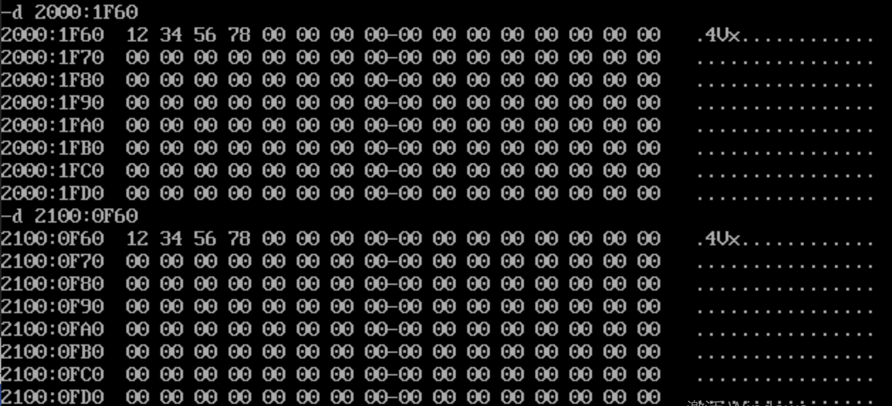

# 测试文档

## 第一章节 主要的语法

### 基本的文字内容

+ 第一点
+ 第二点
+ 第三点

1. 第一点
2. 第二点
3. 第三点

**表格：**

|第一列|第二列|
|:---:|:---:|
|1|2|

> 这里引用了《。。。》谁谁谁的一句话：“”

**代码块：**

第一种形式的代码块：``code segment``

第二种形式的代码块：

```C++
#include<iostream>
using namespace std

int main()
{
  return 0;
}
```

### 基本的文字修饰

加粗：我要强调接下来我要说的话：。。。。**我要说**
倾斜：我要强调接下来我要说的话：。。。。*我要说*

倾斜➕加粗：我要强调接下来我要说的话：。。。。***我要说***

内嵌一些Html语言，去修饰文字

<center>居中在页面的文字</center>

<center><b>加粗居中的文字</b></center>

<p>这是第一段文字</p>

<p>这是第二段文字</p>

### 插入媒体、图片、链接

图片：



链接：

[你要到达的链接](https://thinking-builder.github.io/NoteSite/easy%20markdown/)

媒体：不建议，没有这个基础的语法

