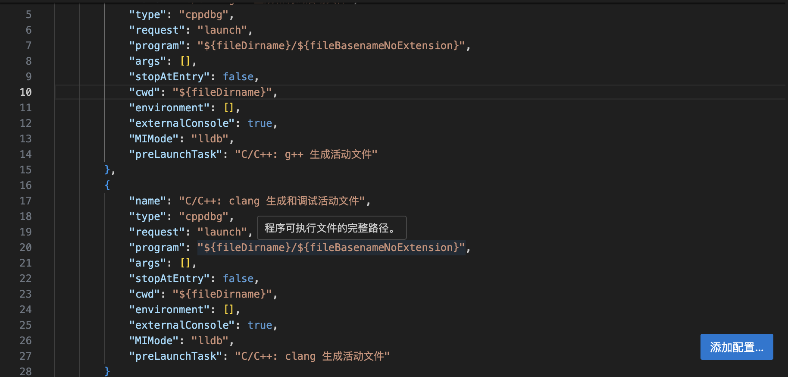

# C++_Debug_Record

> 本片文章重点不是C++基础知识，而是关于各个知识块可能出现的问题。
> 本片blog是对各种可能出现的问题进行了整理收录。

## 关于**编译器**

### vscode

!!! question 编译器报错
    ``Unable to perform this action because the process is running.``

- Solution:</br>
[具体参考，点击此处](https://stackoverflow.com/questions/41074170/unable-to-perform-this-action-because-the-process-is-running)


> 注意，上下有**两个**externalConsole需要修改！

## 输入/输出流

> 该词条下重点讨论cin/cout,scanf/printf

### scanf

```C++
//1. 什么可以包含在“”里面
    printf("Write a number: ");
    scanf("%d", &x);

    printf("Write a character: ");
    scanf(" %c", &y);

//instead of this below:
    scanf("x = %d\ny = %d",&x,&y);
```

## Function

### swap函数

> 下面直接给出swap函数的使用案例

```C++
void swap_1(int *x,int *y);
void swap_2(int &x,int &y);

int main()
{
    int a = 1,b = 2;int *p = &a;int *q = &b;
    swap_1(p,q);cout<<a<<" "<<b<<endl;
    swap_2(a,b);cout<<a<<" "<<b<<endl;
    return 0;
}

void swap_1(int *x,int *y)
{
    int t;
    t = *x;
    *x = *y;
    *y = t;//理解p、q指针指向的内存空间的数据被交换了
}

void swap_2(int &x,int &y)
{
    int temps;
    temps = x;
    x = y;
    y = temps;//int a; int &ra=a;定义引用ra,它是变量a的引用，即别名；原理差不多
}
```

## 指针使用

### 指针与数组

!!! tip 提示
    这里以二维数组为例子，我们知道数组名就是类似指针。
</br>

```C++
    //PART 1 理解数组名
    int b[3][2] = {{0,1},{2,3,},{4,5}};
    int (*a) [2] = b;//注意这里没有取地址&
    //int ** a = &b;//错误，类型不匹配，二维数组的名称的类型是int (*)[2];
    int (*q) [2] = &b[0];
    cout<<a<<" "<<q;

    cout<<endl<<b[0]<<" "<<b[1]<<endl;

    int *m = b[0];

    cout<<m<<" "<<b+1;//这一点证明二维数组b[0]是一个指针；并且他的数据类型是int（*）并且：b == &b[0];*(b[0]) == b[0][0];
```

??? success 拓展
    如果我们无法确定一个指针的类型，我们该如何打印这个指针？
    ```C++
    int b[3][2] = {{0,1},{2,3,},{4,5}};
    cout<<(void*)b[0]<<endl;//使用强制类型转换（void*）
    ```

```C++
    //PART 2 理解下标
    int A[3][4] = {1,2,3,4,5,6,7,8,9,10};
    int (*pa)[4] = A;
    cout<<*pa[1]<<endl;
    cout<<(*pa)[1]<<endl;
    cout<<*(pa+1)[1]<<endl;//重点关注这个：笔者认为下标的意义在于告诉机器指向地址的指针的偏移量

    //结果是：5 2 9；
```

!!! abstract 结论
    - 二维数组名是int（*）[]类型，b[0]本身是int（*）类型
    - 下标 = **地址偏移量** = 起首地址 + 数字\* 单位（即是int[num]或者是int为单位移动）

### 指针与函数

一般来说，指针与函数之间的关系有三种：
[1] 指针作为参数传递

- 注意，二维数组名/指针作为实参传递时，注意参数的数据类型的写法：int ** 或者 int (*)[];

[2] 函数指针：指向函数的指针

!!! note 函数指针的应用 - 回调函数
    将函数指针作为参数</br>（本质：调用函数在不同的场景需要不同的函数指针作为参数）
    ```C++
    void print(int*);
    void opp(int*);
    void down(int *);
    typedef void (*print_mode)(int*);
    for_each(int a,int b,print_mode p)
    int main()
    {
        for_each(a,b,print);
        for_each(a,b,opp);
        for_each(a,b,down);
    }
    ```

[3] 指针函数：返回值为指针的函数

### 指针与常量

> 这一部分最重要的是指针常量和常量指针的具体应用，而不是概念
> 而他们的主要用途是：保护某些数据不要被修改。

```C++
int a = 10;

int * const p = &a;//指针常量，意味着指针的地址不能被修改。
//p = &b error!

int const *p = &a;//常量指针，意味着指针地址指向的值不能被修改。
//*p = 100 error！

int const *const p = &a //常量指针常量，意味着两者都不能修改。
```
