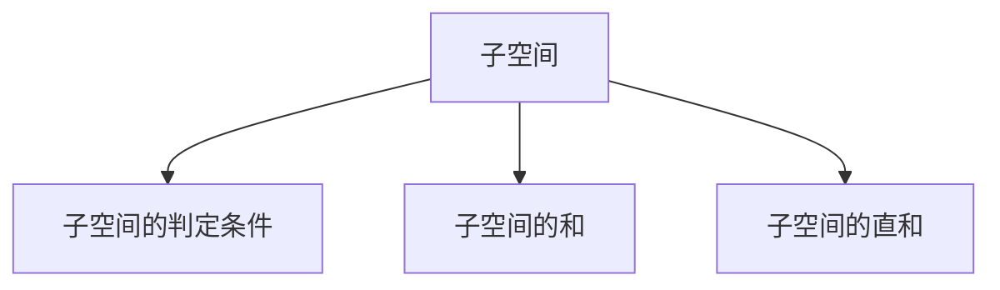
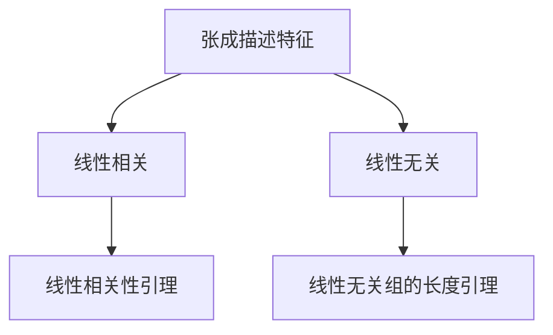
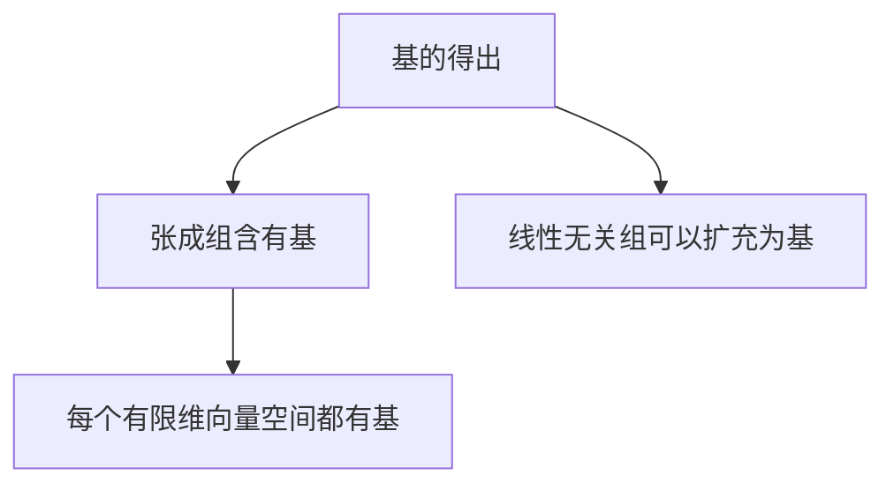
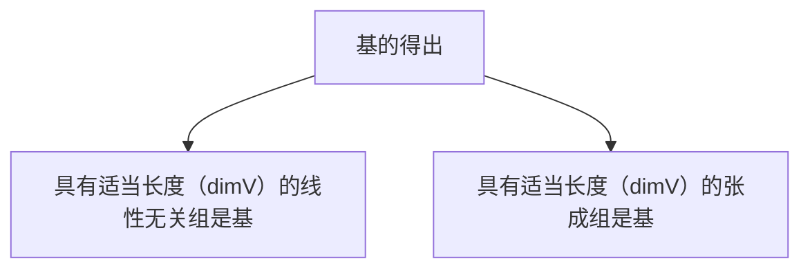

# Note01 向量空间初步

> 本笔记完全参考《Linear Algebra Done Right》，所有记录的相关知识以及总结思考均来自该书的启发。本笔记只是面向个人作为深入学习理解线性代数的垫脚石，解释性质不高，而且没有例子，但是高度凝练，**适合复习的时候审阅核对梳理主干**。

+ 个人认为线性代数分为**3**部分：**矩阵论、向量空间论、算子论**，目前本笔记章节位于向量空间论。
+ 本笔记覆盖的范围 - **1.A ～ 2.C**（参考第三版：《Linear Algebra Done Right，3E》）

在学习《Linear Algebra Done Right》之前，我十分推荐大家参考浙江大学的佬们对这本书以及这门课程制作的一本教辅资料（《LALU》,详情见于浙江大学竺可桢辅学平台）。我建议大家不妨先了解基本的代数结构（群、环、域）然后再看此书，便不会有太多困难。

我们列出我们略去的概念

|线性相关|线性无关|线性组合|
|:---:|:---:|:---:|

## 最基本的一些定义

我们从熟悉的实数$R$出发,适当推广后有复数$C$,为了统筹考虑，我们将$R$以及$C$统一抽象为符号$F$,如果你了解数域（Field），那么就很容易理解这种抽象。而现实世界中我们有$R^2,R^3···R^n$,所以对应的，我们需要定义出来$F^n$完善这个数学体系。

### 组（List）,长度（Length）

设$n$是非负整数，**长度**为$n$的**组**是$n$个**有顺序的**元素，一个n元组($n$-turple)有如下的形式:
$$(x_1,...,x_n)$$

特别的，我们定义**组**$0$：
$$0 = (0,..,0)$$

### $F^n$

$F^n$ 是$F$中元素组成长度为n的组的集合
$$F^n = \{(x_1,...,x_n):x_j \in F, j = 1,2,...,n \}$$

$F^n$的运算性质：（其实就一句话，$F^n$**是域，具有域的运算性质**）

|运算|定义|性质|
|:---:|:---:|:---:|
|加法|$(x_1,...,x_n)+(y_1,...,y_n) = (x_1+y_1,...,x_n,y_n)$|**交换性**: $x+y = y+x$  **结合性**   **存在加法逆元、加法单位元**|
|标量乘法|$\lambda \in F, \lambda(x_1,...,x_n) = (\lambda x_1,...,\lambda x_n)$|具有结合性|

### 向量空间

我们基于$F^n$上的加法以及标量乘法的性质，定义带有这样加法和标量乘法的集合V为向量空间。有如下性质：

1. $<V:+>$是Abel交换群
2. $<V:\times>$是含幺半群
3. 标量乘法对加法运算有左右分配性质

可以进一步有如下推论性质：

1. 加法单位元唯一，就是元$0$
2. 加法逆元唯一，用$-v$标识$v$的加法逆元

!!! Note "关于向量空间的三个备注"
    + **线性空间VS向量空间**:一般来说，线性空间是更加抽象的概念，包含向量空间、矩阵空间等
    + 向量空间的标量乘法依赖于$F$，我们会说，**$V$是$F$上的向量空间**，而不是简单地说$V$是向量空间
    + 参考**环**的定义，为什么向量空间不定义为向量环？

### 子空间

子空间一共需要理清楚三件事情：

**子空间的判定条件** - 大前提，是$V$的子集，并且有加法单位元、关于加法以及标量乘法封闭。

**子空间的和** - 设$U_1,...,U_m$都是$V$的子空间
$$U_1 + ... + U_m = \{u_1+...+u_m:u_1 \in U_1,...,u_m \in U_m \}$$

+ 容易证明，$U_1 + ... + U_m$是$V$的包含$U_1,...U_m$的**最小子空间**。

**子空间的直和** - 如果$U_1+...+U_m$中的每个元素都可以唯一地表示为$u_1+...+u_m$,那么有$U_1 \oplus ... \oplus U_m$(子空间的和是直和)

!!! Note "直和的条件"
    结合已有的数学理解基础，我们知道其实就是这些子空间“**线性无关**”

    + “$U_1 + ... + U_m$是直和”当且仅当“0表示成$u_1+...+u_m$（其中每个$u_j \in U_j$）的唯一方式就是每个$u_j$都等于0”
    + 特别地，两个子空间的直和的条件就是两个子空间的交集是{0}:
    $$U\oplus W \Leftrightarrow U\cap W = \{0\}$$
    + (2.34) $V$的每个子空间都是$V$的直和项：
    $$V=span(v_1,...,v_n),U\subseteq V,\exists W \subseteq W,st.V = V \oplus W$$

## 有限维度向量空间是线性代数研究对象

!!! Question "为什么有限维度向量空间是研究对象?"
    参考《Linear Algebra Done Right，3E》3.67的说法，线性代数中最重要、最深刻的内容就是研究**算子**，而在有限维度情形下，我们算子的性质十分良好：**单性等价于满性**。

我们在此处强调，**我们引入张成空间的概念，就是为了描述有限维向量空间**，那么可知无限维向量空间就是不可以被张成空间描述。张成空间其实就是我们很熟悉的东西，就是$V$中一组向量所有的线性组合所构成的集合。

下面我们给出张成空间的定义，以及它能够精确描述有限维度向量空间的原因。

### 描述1:张成空间

$$span(v_1,...,v_m) = \{a_1 v_1 + ... + a_m v_m : a_1,...,a_m \in F \}$$
特别地，空向量组$( )$的张成空间定义为{0}.

容易证明，**张成空间是包含这组向量的最小子空间**。这也是它能够恰到好处地描述有限维向量空间的原因。

### 描述2:基与维数

若$V$中一个向量组既线性无关又可以张成$V$,则称之为$V$的**基**

为什么我们使用基描述$V$，因为$V$的基可以使得$\forall v \in V,v = a_1 v_1 + ... + a_n v_n, with \quad a_1,...a_n \in F$（这同样也是**基的判定准则**）.

+ 基也十分容易得来，这也使得我们喜欢基描述$V$。

+ 并且基的长度不依赖于基的选取，**有限维向量空间的任一两个基的长度相同**。基于此，我们定义$$dim V = length(V_{basis})$$

很快我们能够有一些**二级结论**补充基的得出

**对于子空间的维数**：($V$是有限维度)
$$U \subseteq V,st.dim U \le dim V$$

**和空间的维数**：
$$U_1,U_2 \subseteq V,dim(U_1+U_2) = dimU_1 + dimU_2 - dim(U_1 \cap U_2)$$

推广(证明见3.78)：
$$dim(U_1 \oplus ... \oplus Um) = dimU_1+...+dimU_2$$

**积空间的维数**：
$$dim(V_1 \times V_2 \times ...\times V_m) = dimV_1 + ... + dim V_m$$

!!! Summary "本章升华 - 有限维度空间和基"
    我个人以为，前两章节在定义好向量空间和子空间的概念后，传递的一个最重要的信息就是，有限维空间是线性代数研究的中心。并且有限维空间最核心的东西就是**基**，基可以唯一地描述空间的任意向量，同时也代表了空间的维数。解决向量空间的基本问题，我觉得一定会需要从**基**的角度出发（**技巧**：从V的子空间的基扩充到V是很实用的技巧，如下面的第一个例子）。
    为了加强这种体会，我推荐你可以试试以下试题：
    1. （线性映射基本定理）证明：$dimV = dim(null T)+dim(rangeT)$
    2. （3A12）设V是有限维的，并且$dimV>0$，再设W是无限维的，证明$L(V,W)$是无限维的
    3. 思考我们该如何判定两个子空间相等（只需要思路就可以，但是逻辑需要完整
    
    同样地，你会发现随着学习的深入，从基这个比较本质的角度思考问题，很多东西都很简单，比如说，你从基的基角度看线性映射下的矩阵$$M(T):T(v_k) = A_{1,k}w_1+...+A_{m,k}w_m$$ 那么你会发现从矩阵的内容里直接从基的角度理解了这个大概什么样的线性映射（一眼看出来该线性映射的零空间）。

    提醒你，在后续的章节中，从基的角度你能快速的证明或者理解：
    （1）**对偶基** - $V = U_1 \oplus U_2 ,s.t. V^{*} = {U_1}^{0}\oplus {U_2}^{0}$ 