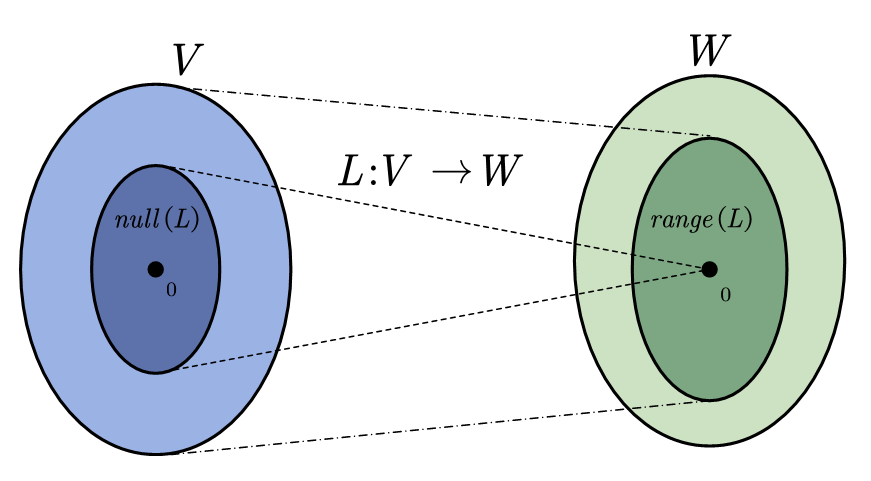

# Note02 线性映射

> 本笔记完全参考《Linear Algebra Done Right》，所有记录的相关知识以及总结思考均来自该书的启发。本笔记只是面向个人作为深入学习理解线性代数的垫脚石，解释性质不高，而且没有例子，但是高度凝练，**适合复习的时候审阅核对梳理主干**。

+ 个人认为线性代数分为**3**部分：**矩阵论、向量空间论、算子论**，目前本笔记章节位于向量空间论。**注意，本部分并不会重视矩阵的理解，同时我们会省略取矩阵乘法的理解，矩阵的秩。后续我们会在矩阵论部分详细说明**
+ 本笔记覆盖的范围 - **3.A ～ 3.D**（参考第三版：《Linear Algebra Done Right，3E》）

我假设你已经有一定高等数学基础，我列出我略去的概念：

|线性映射的定义|单射、满射|线性组合|矩阵的加法、标量乘法|可逆、逆|
|:---:|:---:|:---:|:---:|:---:|

## PART1 线性映射与向量空间

!!! Question "为什么我们能够把线性映射抽象出向量空间这个概念"
    这个问题，换言之：“为什么$L(V,W)$上有许多的线性映射？”
    我们考察一个简单的例子$L(V,V)$：
    这个向量空间的含义是，我们考量V这个空间自己映射到自己的一些线性映射，我们很容易想到有**恒等映射**$(I)$，**平移映射**等。
    还有一个比较简单的案例$L(P(R),P(R))$：
    基于多项式上的线性映射，我们也很容易想到：**乘以$x^2$**、**微分映射**等

### $L(V,W)$

我们设$S,T \in L(V,W),\lambda \in F，\forall v \in V$，给出线性映射之间的基本运算：加法、标量乘法:

+ 加$(S+T)(v) = Sv +Tv$
+ 标量乘法$(\lambda T)(v) = \lambda (Tv)$

基于上面定义的加法和标量乘法，我们可以证明$L(V,W)$**是向量空间**

其实不难理解，线性映射是一种函数，那么函数我们很容易联想到复合函数。类似地，我们于是在线性映射空间中定义**乘积（product of linear maps）**：

+ 若$T \in L(U,V),S \in L(V,W),ST \in L(U,W): \forall u \in U,(ST)(u) = S(Tu)$

我们通过类比能够得到乘积的代数性质：

1. **结合性** $(T_1T_2)T_3 = T_1(T_2T_3)$
2. **单位元** $TI_V = I_WT = T$
3. **左右分配性质** $(S_1+S_2)T = S_1T+S_2T,S(T_1+T_2) = ST_1+ST_2$

!!! Note "线性映射向量空间上的一些二级结论"
    我们不加严格证明地给出一些结论，完整严格证明推荐读者自行完成：
    + **V的子空间上的线性映射可以扩张成V上的线性映射**
    显然，我们可以通过之前在Note01中的结论（V子空间上的一组基可以扩展成为V上的一组基）
    + **线性映射如何判等/不等 等价于 函数判等/不等**
    参考书中的P46，3.A 14

### $Null(T)、Range(T)$

在本节讨论之前，我们通过函数理解下我们为什么引入这个零空间、象空间；我们考虑函数映射的一般性质时，我们会首先考虑函数映射的单射性、满射性，而你参考下高等数学中对这两个东西的描述，你会发现我们在线性代数中也就是从空间的范畴上给出具体的界定。

+ **关于线性映射的单射性（单性、injective）等价于零空间为{0}**

我们给出零空间的定义、单射性的定义就不证自明了：

$$null\; T = \{v\in V:Tv = 0 \}$$

$$Injective:Tu = Tv \rightarrow u = v$$

+ 关于线性映射的满射性（**线性映射的值域是象空间 - W的子空间**）

我们给出象空间的定义、满射的定义，同样不证自明：

$$range\; T = \{Tv:v\in V\}$$

$$Surjective: range\; T = W $$

至此，我们可以得到线性映射基本定理($V,rangeT$是有限维)：

$$T\in L(V,W),dimV = dim\;null\;T + dim\;range\;T$$

!!! Tip "对基本定理一个科学通俗的解释"
    我们设$v_1,v_2,...,v_n \in V$是$V$的一组基
    无论是什么线性映射（理解成函数），都会有部分基被压缩成0，其他的是正常非0值
    那么我们不妨假设$\forall v_i:1 \le i\le n \le m$
    有$Tv_i = 0$,而其他的基经过$T$不为0.
    现在，$V$中的基被分为了两个部分，前面的$v_i$张成了零空间。
    后面的基经过$T$后显然是象空间的基（书3A：3.5）
    从维度上就可以得到上面的结果。
    + 你可能有这样的疑问，为什么用0来划分？
    **0在向量空间很特殊**，你会发现，V的所有子空间的交就是{0}

于是我们有如下重要推论：

+ **到更小维度的向量空间的线性映射不是单的**
+ **到更大维数向量空间的线性映射不是满的**

## PART2 具象化的线性映射

### 线性映射表示线性方程组

我们尝试使用线性映射对**齐次线性方程组**进行描述，定义$T:\mathbf{F}^n \rightarrow \mathbf{F}^m$：

$$
\left\{\begin{matrix}
   {\textstyle \sum_{k=1}^{n}A_{1,k}x_k} = 0  \\ ... \\
  {\textstyle \sum_{k=1}^{n}A_{m,k}x_k} = 0
\end{matrix}\right.
\Leftrightarrow
T(x_1,...,x_n) = ({\textstyle \sum_{k=1}^{n}A_{1,k}x_k},...,{\textstyle \sum_{k=1}^{n}A_{m,k}x_k})
$$

上述方程是含有$n$个变量$x_1,...,x_n$和$m$个方程的齐次线性方程组，与此相对应的事$T:\mathbf{F}^n \rightarrow \mathbf{F}^m$,上面一个小节最后一个结论，到更小维度的向量空间的线性映射不是单的。所以当$n>m$,也即是说**当变量多于方程时，齐次线性方程组必有非零解**。

以同样的方式我们可以考虑非齐次线性方程组，但是我们要考虑的问题是：

$$
\left\{\begin{matrix}
   {\textstyle \sum_{k=1}^{n}A_{1,k}x_k} = c_1  \\ ... \\
  {\textstyle \sum_{k=1}^{n}A_{m,k}x_k} = c_m
\end{matrix}\right.(1)
$$

现在是否存在某些常数$c_1,...,c_k\in \mathbf{F}$使得上述方程组无解。

$$T(x_1,...,x_n) = (c_1,...,c_m)\quad (2)$$

方程(2)与方程组(1)是一样的。问题其实等价于是否在$\mathbf{F}^m$中是否是满的，如果不是满的，说明有一组$(c_1,...,c_m)$使得上面方程(1)不成立。由于上面一个小节最后一个结论，到更大维度的向量空间的线性映射不是满的。所以当$n<m$,也即是说**当方程多于变量时，必有一组常数项式的相应的非齐次线性方程组无解**。

### 线性映射的矩阵

设$T \in L(V,W)$，并设$v_1,...,v_n$是$V$的基，$w_1,...,w_m$是$W$的基。规定$T$关于这些基的矩阵为$m \times n$矩阵$M(T)$，其中$A_{j,k}$满足：

$$T_{v_k} = A_{1,k}w_1+...+A_{m,k}w_m$$

    

        
    

我们给出线性映射矩阵的运算性质：

1. $S,T \in L(V,W),M(S+T) = M(S)+M(T)$
2. $\lambda \in \mathbf{F},T \in L(V,W):M(\lambda T) = \lambda M(T)$
3. $T \in L(U,V),S\in L(V,W):M(ST) = M(S)M(T)$

我们发现这个线性映射矩阵很类似我们第一次接触的矩阵，在此我们给出所有$m \times n$矩阵的集合，记做$\mathbf{F}^{m,n}$

按照上面定义的矩阵的加法和标量乘法，我们容易证明知道，$\mathbf{F}^{m,n}$是一个向量空间。而这个向量空间的维数：

$$dim\;\mathbf{F}^{m,n} = mn$$

+ **将线性映射视为矩阵乘法**

我将用两个观点来说明这个事情，此点需要结合下面PART03部分的不同线性映射的同构。

1. 线性映射的作用十分类似矩阵乘法

我们已经定义了关于线性映射的矩阵$M(T)$，现在我们定义向量的矩阵$M(v)$,设$v\in V$，设$v_1,...,v_n$是 $V$ 的基。那么$M(v)$：

$$M(v) = \begin{pmatrix}  
  c_1\\  
  \vdots\\  
 c_n  
\end{pmatrix} $$

这里$c_1,...,c_n$是使得下面式子成立的标量:

$$v = c_1v_1+ ... + c_nv_n$$

根据上面的定义，我们能得到一个很重要的定理「$M(T)$的第k列等于$M(Tv_k)$」：

$$M(T)_{\cdot,k} = M(Tv_k)$$

综上所述，我们有：

$$\because Tv = c_1Tv_1+...+c_nTv_n$$

$$\therefore M(Tv) = c_1M(Tv_1)+...+c_nM(Tv_n) \\=c_1M(T)_{\cdot,1}+...+c_nM(T)_{\cdot,n} \\  = M(T)M(v)$$

上述结论说明了一件事情，如果我们可以把问题化成我们熟悉的矩阵，然后我们便可以从矩阵的角度给出线性映射的内容。也即是线性映射的作用类似于矩阵乘

2.  $L(V,W) \cong F^{m,n}$

我们其实很容易得到两个空间的存在的一个自然同构$M$，$M$就是之前定义在线性映射的矩阵、向量矩阵中的$M$。于是我们知道**线性映射的矩阵空间和线性映射空间是同构的**。

P.s $dim\;L(V,W) = (dim\;V)(dim\;W)$

## PART3 不同的线性映射

> 本模块着重介绍两种映射：同构、算子（简单介绍）

### 可逆 - 同构映射

我们在声明部分虽然说了忽略线性映射的可逆和逆，但是我们还是给出比较重的事情：

1. 可逆性等价于单性和慢性
2. 可逆的线性映射有唯一的基

我们在可逆的基础上引入同构。可逆性预示着两个向量空间之间存在一一对应的关系，就像笛卡尔坐标系和几何图形其实是本质一样，在线性代数中，**我们刻画出了元素的名字之外本质上相同的两个向量空间为同构的**

+ 当两个向量空间存在一个同构（也就是可逆映射），则两个向量空间是同构的

+ $\mathbf{F}$**上两个有限维向量空间同构当且仅当维数相同**

### 自身映射 - 算子

向量空间到滋生的线性映射十分重要，这个重要性会在算子论的讲解中逐渐明了。我们称，向量空间到自身的线性映射是**算子**。同时记$L(V)$表示$V$上全体算子所组成的集合。

!!! Note "算子的优美性质"
    **存在有限维的情况，单性等价于满性**
    设V是有限维，并且设$T \in L(V)$，则下列称述等价：
    （a）T是可逆的（b）T是单的（c）T是满的

最后的最后，我想提醒一下读者，在使用上述定理时候，**请注意是否是在有限维的情况下**
