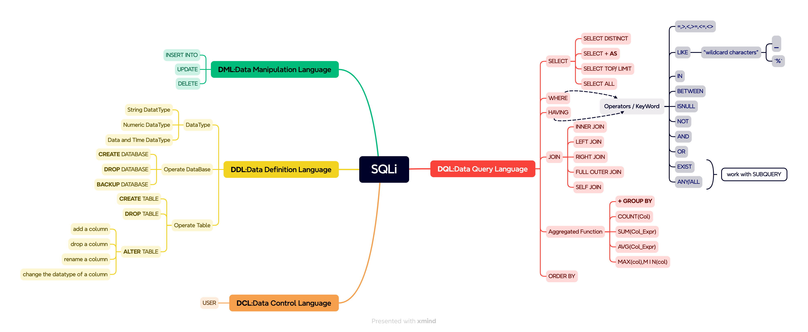

# SQL

SQL:**S**tructured **Q**urey **L**anguage,
and SQL consists of DML,DDL and DCL:

+ **D**:Data, **L**:Language
+ **M**:Mutiplation, **D**:Definition, **C**:Control

> If you want to learn SQL, I recommend [W3School-SQL](https://www.w3schools.com/sql/) to you for its interactive feature.

Now, I give you the map of SQLi(Lite but Core SQL language mainly used in programming).

