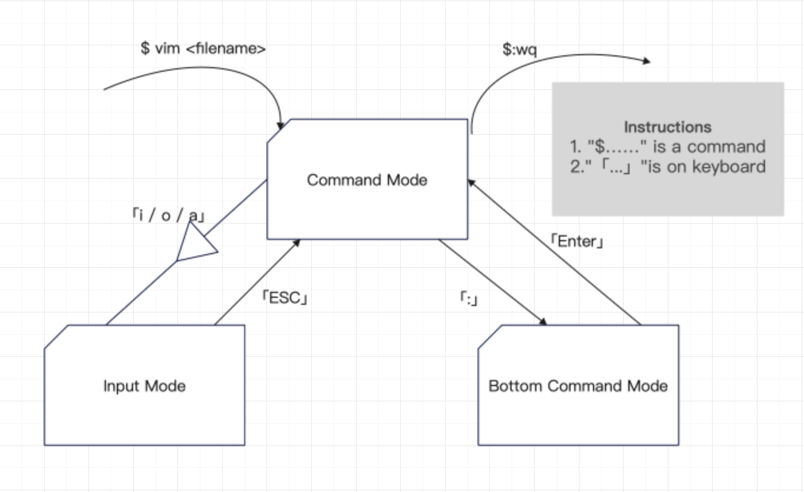

# Easy Vim

> This article is aimed to explain what ``vim`` it is. After Readinging ``Easy Vim`` with adequate practice, You will be more likely to choose ``vim`` as your usual developer tools to design your programme.

## level.1 Entry-level

!!! tip "Goal"
    What you should grasp:
    - Know **three modes of Vim editor** - Command Mode、Bottom Command Mode、Input Mode and can easily ship from one to another.
    - Under Bottom Command Mode,you should know how to use basic command.
    - Under Input Mode, you should know how to edit without any difficulies.

### Three Modes

How to wake up or open your Vim?

=== "Windows"

    Windows need to install Vim.
    After installation, you click ``Cmd`` and input ``vim <filename>`` to open Vim.

=== "Macos"

    As we know, mac is equipped with ``vim``.
    So You just need to click ``Terminal`` app and input ``$ vim <filename>`` to open Vim
